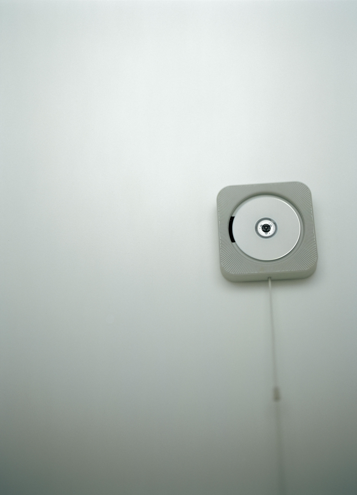

好的设计不急着解释功能，而是先让人的身体知道“可以这样用”。深泽直人的 MUJI 壁挂式 CD 播放器之所以耐看，不是因为它足够白、足够少，而是因为它把操作说明藏进了一个非常自然的身体动作里。

这个播放器被做成一个挂在墙上的白色方形物，CD 裸露在中心，下方垂着一根细绳。它不像传统音响那样强调按钮、屏幕和参数，而是把“播放”这件事转译成一个更日常的动作：拉一下绳子。

很多人第一次看到它，会自然联想到排气扇、灯绳或旧式开关。不必先读说明书，身体经验已经替界面完成了提示。

这里真正重要的不是“极简外观”，而是**让形式承担说明**。白色外壳降低了视觉噪音，让注意力集中在两处：旋转的 CD 和垂下的绳。CD 旋转提供持续反馈，声音不是从一个黑盒里凭空出现，而是来自眼前这个正在运动的介质。

拉绳则承担可供性。它不是一个被隐藏的控制点，而是一个邀请手去触碰的线索。留白在这里也不是装饰性的空，而是让动作、反馈和物体状态之间的关系更清楚。

容易误用的地方，是只模仿白色、方形、无按钮，最后得到一个冷淡的空壳。真正可学的不是“把说明拿掉”，而是先用布局、动词、状态和可触达的形态暗示下一步；只有当行为线索不够时，才补充文字说明。

**追问：** 一个界面是在帮助人自然理解下一步，还是只是把说明文字藏得更深？

> [!quote] 参考资料
> - [Wall-mounted CD Player — Naoto Fukasawa](https://naotofukasawa.com/projects/540/)
> - [CD Player — Victoria and Albert Museum Collection](https://collections.vam.ac.uk/item/O1227135/cd-player-fukasawa-naoto/)
