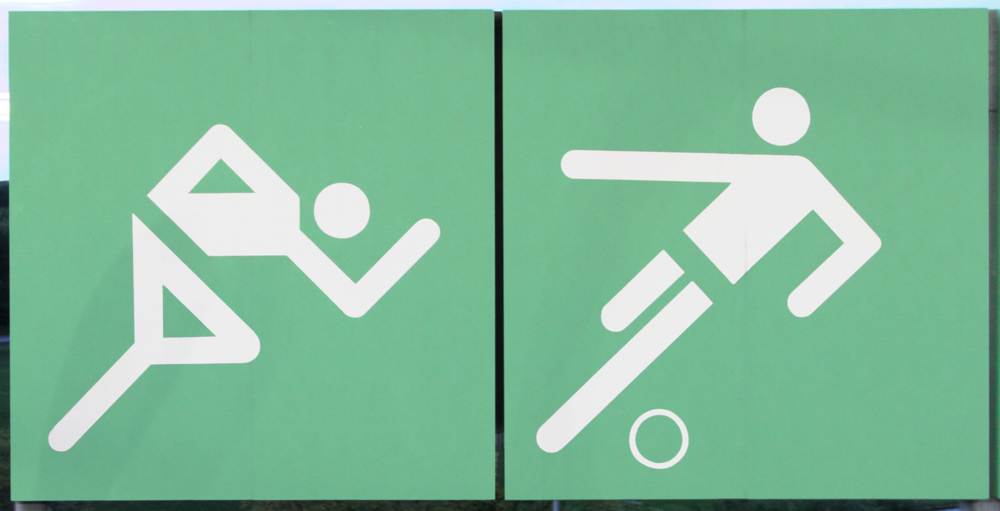

## 一句话结论

Otl Aicher 为 1972 慕尼黑奥运建立的图形符号系统，不是把运动画成更漂亮的图标，而是把复杂公共空间里的判断压力降到最低。

## 研究对象

Otl Aicher 与 1972 慕尼黑奥运图形符号系统

## 背景

Aicher 曾共同创办乌尔姆设计学院，长期把设计看作一种清晰、可验证、可复制的公共语言。

1972 年慕尼黑奥运需要面对跨语言观众、庞大场馆、快速移动的人流和不同文化背景；如果每个项目都靠文字说明，信息会变慢，也会变得不公平。

Aicher 团队的关键不是做一组“运动插画”，而是建立一套能在标牌、手册、地图、票务、电视转播和纪念物中反复工作的视觉语法。

## 代表作品 / 关键画面

田径符号里，人体被压缩为头、躯干、四肢和斜向动势。它没有表情、肌肉和衣褶，却保留了“正在奔跑/跳跃”的方向感。抽象不是为了冷淡，而是为了让识别发生在一瞬间。

自行车符号更能说明系统性：轮子、身体倾角、车架关系都被纳入统一的线宽、角度和比例。它看起来像一个图标，实际是一条规则的结果。

当符号出现在真实场馆标牌上，意义不只来自造型，也来自对比度、留白、安装位置和观看距离。公共设计最怕在近处好看、远处失效。

多枚符号并置时，系统价值才真正显现：不同项目保持同一语气，观众不用重新学习每一个图形。

## 视觉 / 交互语言

Aicher 的符号系统有几个很安静但重要的决定。

第一，所有对象都被放进同一套几何约束里：角度、线宽、黑白关系、人体比例接近一致，因此它们可以作为“家族”被理解。

第二，它用轮廓和负形处理运动，而不是用细节堆叠运动；这让符号在小尺寸、远距离、低印刷条件下仍然可读。

第三，它几乎不强调作者性。好的公共符号不是让人记住设计师，而是让人少停顿一秒。

## 核心思想

这个系统真正关心的问题，是如何让陌生人在陌生环境里迅速获得方向感。

它的美感来自秩序，而不是装饰；来自可重复的判断规则，而不是单个图形的灵感。Aicher 把“看懂”这件事当作公共服务，而不是审美加分项。

## 对 UI/UX 的启发

软件界面里的图标、状态、导航和空状态也常常承担同样任务：让人不必读完说明就知道发生了什么、可以去哪里、下一步能做什么。

Aicher 的启发不是把界面全部变成黑白几何图标，而是先建立一套稳定语法：同类动作用同类形状，同级信息用同级权重，危险/成功/等待/不可用状态有一致的反馈方式。

一个界面如果每个按钮都很漂亮，但每个图标都像来自不同系统，使用者就会不断重新判断。

## 对作品集 / 海报 / 摄影 / 品牌的启发

视觉作品可以借鉴它的“系列意识”。海报不只是单张画面，品牌不只是一个 logo，摄影项目也不只是一张好照片。

真正成熟的表达通常能回答：多张并置时是否仍有同一种节奏？换到小尺寸、黑白、远距离、不同材质时是否还成立？

Aicher 的方法提醒设计工作少一点单点炫技，多一点可延展的秩序。

## 不要表面模仿

不要把 1972 慕尼黑奥运的符号当作复古体育图标风格来复制。表面模仿会得到“几何、黑白、斜线、圆头人”的外壳，却失去它的核心：公共环境、跨语言识别、系列一致性和低认知负担。

也不要误以为克制就是没有情绪；这个系统的情绪是开放、明亮、有秩序，服务于一届试图以轻盈和现代性重新定义形象的奥运会。

## 可迁移原则

1. 先定义系统语法，再设计单个图标；一致性比单枚图形的聪明更重要。
2. 把识别距离、尺寸、材质和使用速度当作设计变量，而不是交付之后才检查的限制。
3. 用负形、比例和方向表达含义，少依赖纹理、表情和装饰细节。
4. 公共信息设计的目标不是“被欣赏”，而是在关键时刻减少犹豫。
5. 若一个视觉元素无法和同类元素并置成体系，它可能只是插画，不是界面语言。

## 追问

它是否让体验更清楚、更安静、更自然？Aicher 的答案很明确：符号越能退到背景，人的行动越能回到前景。

设计工作不必总是制造新的视觉刺激，有时更重要的是建立一套不会打扰人的判断秩序。

## 参考资料

- [Athletics pictogram black (1972 Summer Olympics style) — Wikimedia Commons](https://commons.wikimedia.org/wiki/File:Athletics_pictogram_black_(1972_Summer_Olympics_style).svg)
- [Cycling pictogram black (1972 Summer Olympics style) — Wikimedia Commons](https://commons.wikimedia.org/wiki/File:Cycling_pictogram_black_(1972_Summer_Olympics_style).svg)
- [Olympic games 1972 basketball 0501 — Wikimedia Commons](https://commons.wikimedia.org/wiki/File:Olympic_games_1972_basketball_0501.JPG)
- [Olympic games 1972 pictogramms olympic station 0877 a — Wikimedia Commons](https://commons.wikimedia.org/wiki/File:Olympic_games_1972_pictogramms_olympic_station_0877_a.jpg)
- [Otl Aicher — Cooper Hewitt, Smithsonian Design Museum](https://collection.cooperhewitt.org/people/18054493/)
- [Otl Aicher — Wikipedia](https://en.wikipedia.org/wiki/Otl_Aicher)
- [Munich 1972 Design / Logo — Olympics](https://olympics.com/en/olympic-games/munich-1972/logo-design)
