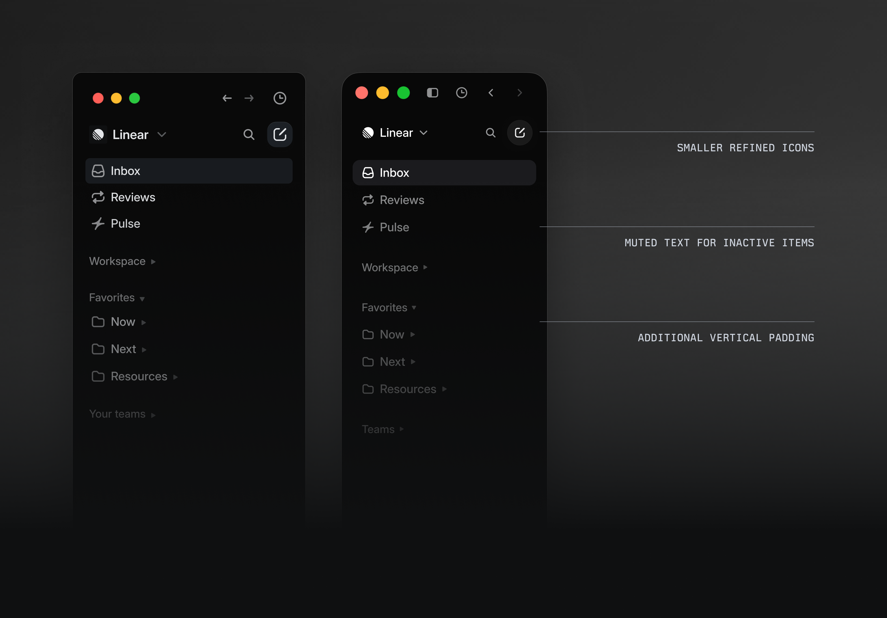
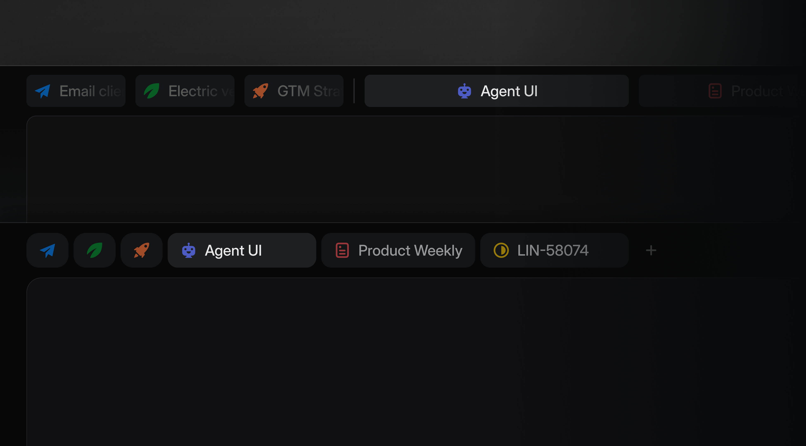
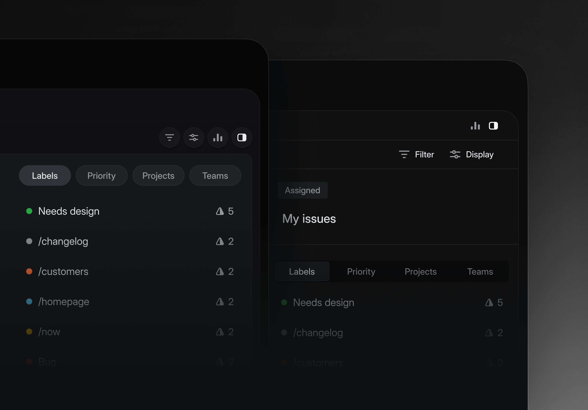

界面的秩序不一定要被看见，最好是先被感觉到。Linear 这次界面刷新里最值得拆的不是“更暗、更圆、更克制”，而是它把导航、边框、图标这些辅助层级往后退了一步，让主要工作区重新成为视觉中心。

在信息密集型工具里，侧边栏、标签栏、分割线原本都是帮助定位的部件。但当它们的亮度、图标、边框和占位太接近正文区域时，用户会持续感到“每个地方都在说话”。Linear 的处理方法很细：降低非当前区域的文字和图标权重，缩小顶部标签，把部分标签变成只保留图标的小胶囊，让它们仍然可用，却不再抢任务本身的注意力。

更关键的是边框。分割线的职责不是装饰，而是说明关系：谁属于谁，哪里结束，哪里开始。过多、过硬的线会让页面像被切碎；完全没有线又会让结构坍塌。好的分割应该像空气中的折痕——能帮助眼睛转向，但不会成为观看对象。

这类改动容易被误读成“把颜色调灰一点”。真正可迁移的原则是：**辅助元素要有足够的可辨认性，但不要长期占用注意力**。如果一个控件只是帮助抵达目的地，它就不该在抵达之后还保持同等音量。

**追问：** 一个界面里，哪些元素只需要在“寻找方向”时被看见，而不应该在“开始工作”后继续抢注意力？

> [!quote] 参考资料
> - [A calmer interface for a product in motion - Linear](https://linear.app/now/behind-the-latest-design-refresh)
> - [Layout overview - Material Design 3](https://m3.material.io/foundations/layout/layout-overview/overview)
