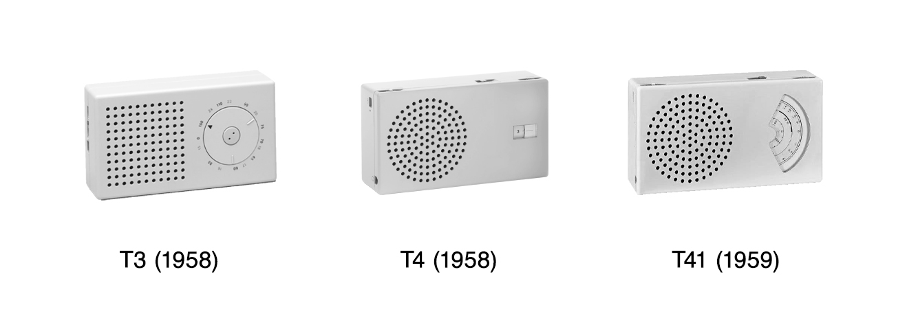
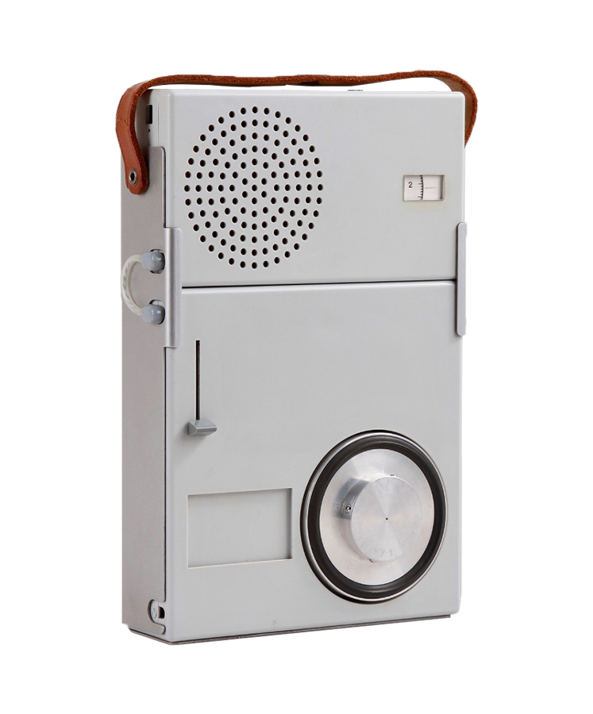

Dieter Rams 的克制不是“少画一点”，而是把产品里的每个视觉决定都压回功能关系里。Braun 的收音机、唱机和计算器之所以安静，不是因为它们缺少性格，而是因为它们把性格交给了比例、网格、按钮距离和操作顺序。

看 Braun T3、T4、T41 这一组小收音机，最值得借鉴的不是“白色外壳 + 圆形喇叭孔”的表面语言，而是信息被安排得很诚实：喇叭负责发声，旋钮负责调节，刻度负责读数，品牌标识退到几乎不会打扰的位置。界面没有努力证明自己高级，只是让手和眼睛各自知道下一步在哪里。

这种低声量秩序放到软件里，常常比“极简风格”更有用。一个设置页、命令面板或仪表盘，不需要把所有东西都做淡；真正重要的是让控件的轻重、分组和反馈符合任务路径。该被发现的入口要清楚，该被长期忽略的结构就安静，该在出错时跳出来的提示才获得更高声量。

容易误用 Rams 的地方，是只复制冷静、灰白、细线和大留白。那会把设计变成一种表情，而不是一种判断。更值得吸收的是：**让元素少说话，但让关系说清楚。** 当关系足够清楚，界面可以朴素，也可以有温度；它只是不会用装饰替代秩序。

**追问：** 当前正在做的界面里，有哪些元素是在“证明设计感”，而不是帮助用户判断、操作或恢复？

> [!quote] 参考资料
> - [Vitsœ — Dieter Rams: ten principles for good design](https://www.vitsoe.com/us/about/good-design)
> - [Vitsœ — Dieter Rams](https://www.vitsoe.com/us/about/dieter-rams)
> - [Wikimedia Commons — RadioT3-4-41.jpg](https://commons.wikimedia.org/wiki/File:RadioT3-4-41.jpg)
> - [Wikimedia Commons — DieterRamsTP1Perspective.jpg](https://commons.wikimedia.org/wiki/File:DieterRamsTP1Perspective.jpg)
