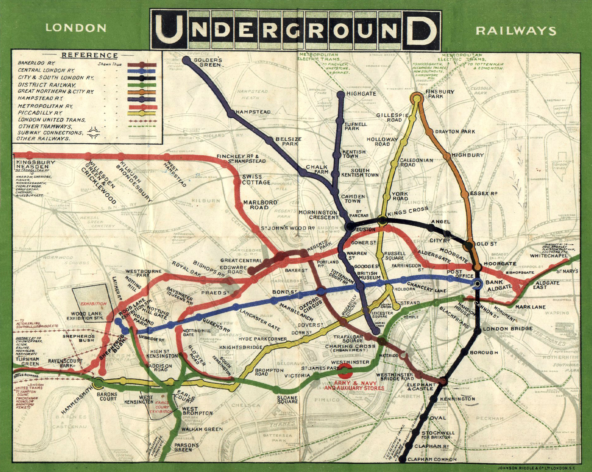

伦敦地铁图最值得看的地方，不是它把城市画得多准确，而是它主动放弃了一部分准确。Harry Beck 1930 年代提出的地铁图，把弯曲街道、真实距离和地面方位退到后面，只保留乘客真正需要判断的关系：线路、换乘、终点、经过顺序。

这是一种很克制的“失真”。它不是为了风格化，而是为了把问题换成更合适的尺度：乘客在地下并不需要知道两站之间真实相隔几百米，也不需要每一段铁轨的实际弯曲；更需要知道“该坐哪条线、在哪换、方向有没有错”。于是地图从地理作品变成了决策工具。

这个案例对界面设计也很直接。很多复杂产品会执着于完整还原真实结构：组织架构、数据库字段、流程全貌、权限层级，好像越真实越专业。但用户多数时候并不是来欣赏系统原貌，而是来完成一次判断。好的界面可以像 Tube Map 一样，适度牺牲底层真实，换取行动路径的清楚。

需要警惕的是，简化不等于随便删。Tube Map 之所以成立，是因为它保留了乘客决策所需的关系，并用一致的角度、颜色、站点节奏和换乘标记补偿了地理失真。若界面只删细节，却没有建立新的关系秩序，用户得到的不是清爽，而是迷路。

**追问：** 当前正在设计的一个复杂页面里，哪些“真实信息”其实可以退后一步，让用户先看见关系、顺序和下一步动作？

> [!quote] 参考资料
> - [Tube map - Wikipedia](https://en.wikipedia.org/wiki/Tube_map)
> - [Tube and rail maps - Transport for London](https://tfl.gov.uk/maps/track/tube)
> - [File:Tube map 1908-2.jpg - Wikimedia Commons](https://commons.wikimedia.org/wiki/File:Tube_map_1908-2.jpg)
> - [File:London Underground Overground DLR Crossrail map.svg - Wikimedia Commons](https://commons.wikimedia.org/wiki/File:London_Underground_Overground_DLR_Crossrail_map.svg)
