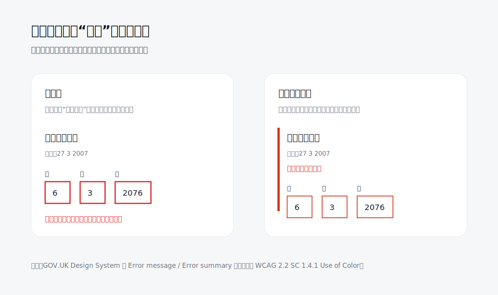

很多表单错误看起来“已经设计过”：输入框变红、旁边出现红字、按钮下面再加一段提示。但常见误区是，把错误状态理解成一种颜色，而不是一条可修复的路径。红色只能制造警觉，不能自动回答三个问题：哪里错了、为什么错、下一步怎么改。

GOV.UK Design System 的 Error message 做得克制，但它的克制不是少写字。它把错误说明放在问题和提示之后，用红色边线把这一组内容连起来，保留用户原来的输入，并让文案直接指向可修复动作，例如“日期必须早于今天”。这比一句“格式错误”更像界面在承担责任：系统没有把判断压力推回给用户，而是把关系重新摆清楚。

WCAG 也提醒过同一件事：颜色不应成为传达信息的唯一方式。这里的重点不只是照顾色觉差异，也是在照顾疲惫、分心、赶时间的人。越是关键状态，越不能只靠视觉情绪；它需要文字、位置、形状、焦点、语义和保留现场共同工作。

反面案例通常有三种：只把边框标红但不解释；用“此字段必填”这类泛化文案代替具体问题；提交失败后清空输入，让用户重新劳动。它们的问题不是“不够好看”，而是把修复成本藏进了用户的下一秒。

更好的做法是：让错误信息贴近相关字段，复用字段名称，说明具体原因，保留已填内容，并在页面顶部用错误摘要帮助用户回到问题位置。颜色仍然可以存在，但它只负责提醒，不负责全部沟通。

**追问：** 当前界面里有哪些状态，是只靠颜色在说话，而没有给出真正的修复路径？

> [!quote] 参考资料
> - [GOV.UK Design System: Error message](https://design-system.service.gov.uk/components/error-message/)
> - [GOV.UK Design System: Error summary](https://design-system.service.gov.uk/components/error-summary/)
> - [W3C WAI: Understanding SC 1.4.1 Use of Color](https://www.w3.org/WAI/WCAG22/Understanding/use-of-color.html)
