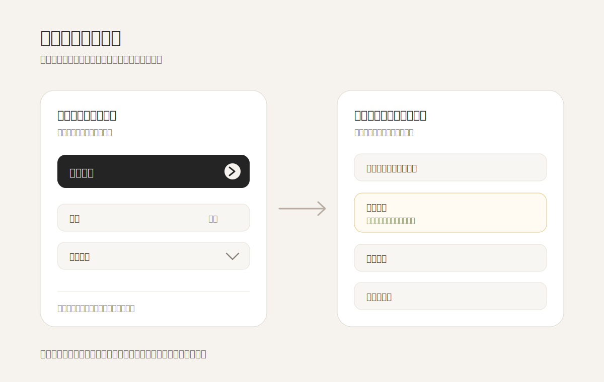

好的界面不是把所有可能性一次性摆出来，而是先让人知道“下一步该做什么”。**渐进披露**的重点并不是隐藏功能，而是把复杂判断推迟到用户已经产生意图之后。第一屏要承担方向感，第二步才承担细节。

这件事很容易被误解成“少放一点东西”。但真正的少，不是数量少，而是用户在当前时刻需要比较的东西少。比如一个创建流程，一开始只需要让人判断：继续、换模板、还是查看更多；高级规则、例外条件、危险操作可以等选择发生后再出现。这样界面不是变贫乏，而是把注意力放在时间顺序里。

Apple Human Interface Guidelines 里对 disclosure controls 的提醒很朴素：它们应该揭示与当前上下文有关的附加信息，而不是把页面变成一堆折叠仓库。NN/g 对 progressive disclosure 的解释也类似：先显示少量最重要选项，减少认知负担；再根据用户需要逐步展开更专门的内容。

可迁移的原则是：**不要问一个还没有形成意图的人做精细判断。**在界面设计里，第一层信息应该帮助进入；第二层信息才帮助调校；第三层信息再处理例外。若把三层同时摊开，用户看到的是“功能丰富”，身体感受到的却是“我不知道从哪里开始”。

**追问：** 当前界面里，有哪些信息其实应该等用户完成第一个选择之后再出现？

> [!quote] 参考资料
> - [Apple Human Interface Guidelines: Disclosure controls](https://developer.apple.com/design/human-interface-guidelines/disclosure-controls)
> - [Nielsen Norman Group: Progressive Disclosure](https://www.nngroup.com/articles/progressive-disclosure/)
