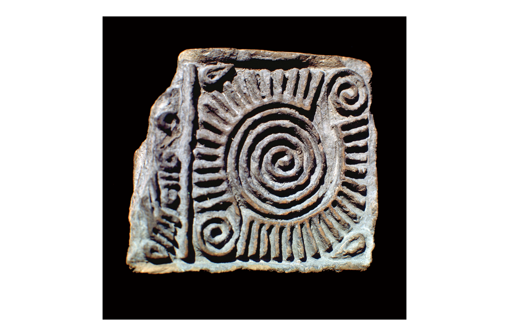
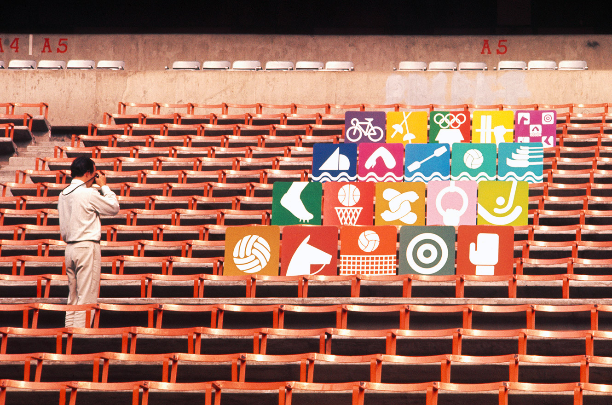
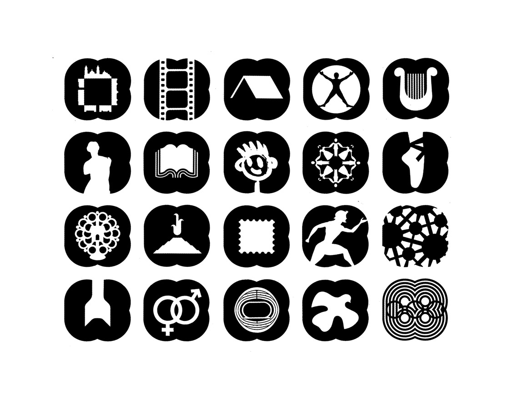
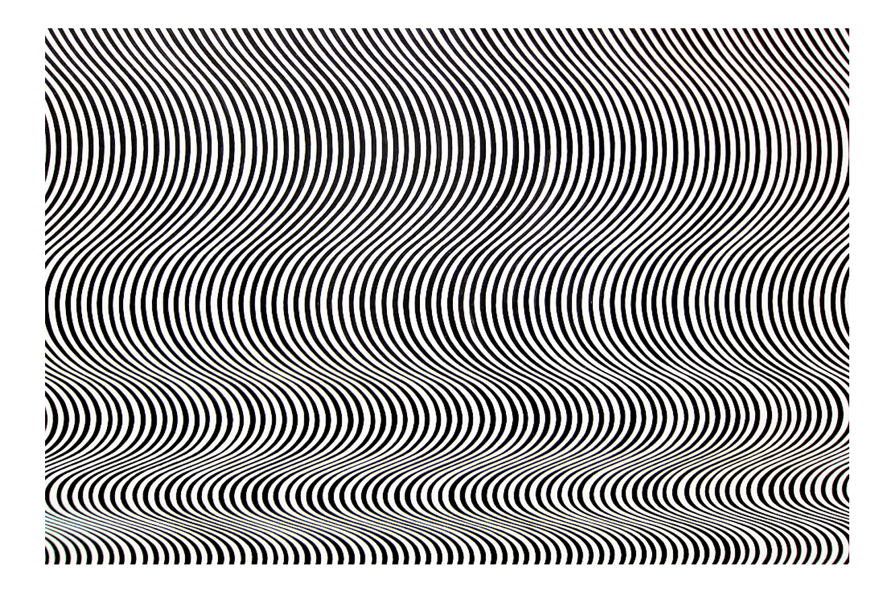
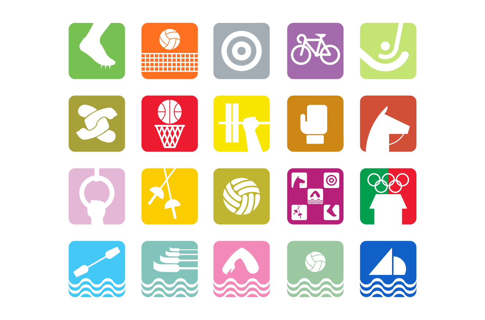

## 一句话结论

Mexico 68 的视觉系统厉害之处，不只是那个足够醒目的标志，而是它把一个标志扩展成了可走、可读、可记忆的公共秩序。Lance Wyman、Eduardo Terrazas 与组委会团队没有把奥运会做成一组漂亮海报，而是把城市、场馆、交通、票券、制服、图标和文化活动放进同一种视觉语法里。

这是一种很适合今天界面设计借鉴的能力：先找到一个能够生长的基本关系，再让所有界面细节从这个关系里自然长出来。

## 研究对象

研究对象是 1968 年墨西哥城奥运会视觉识别，核心设计者通常指向 Lance Wyman，并与 Eduardo Terrazas、Pedro Ramírez Vázquez 等人共同形成完整系统。V&A 对官方海报的说明里提到，这套设计把 Op Art 的动态视觉、前西班牙时期墨西哥图案感，以及 Huichol 民间艺术的线性图像合在一起，表达一种“现代墨西哥”的形象。

真正值得注意的是：这里的“民族性”并没有被处理成表面纹样贴图。它被抽象成线、同心、扩散、振动和节奏，然后接入奥运五环、年份“68”和 Mexico 字样。传统不是装饰材料，而是系统生成规则的一部分。

## 背景

1968 年的墨西哥城是第一次在拉丁美洲举办夏季奥运会。大型国际活动需要在短时间里服务大量陌生人：语言不同、方向感不同、对城市不熟悉，还要在拥挤环境中快速找到场馆、入口、项目和路线。

因此，这套视觉识别的任务不只是传播形象，也是一套临时城市界面。它要让人还没读完说明时，就已经能感到“这是同一个系统”；它要让图标、数字、线条和色彩在远处、运动中、拥挤中依然保持辨识度。

## 代表作品 / 关键画面

第一个关键画面是 Mexico 68 logotype。五环被转化为“68”的一部分，字母则通过平行线和同心扩散获得统一节奏。标志不依赖复杂图形，而依赖一个可以不断延展的构造方法：线从字形里长出来，又可以扩展到海报、环境图形和导视。

第二个关键画面是项目图标和文化图标。它们不是各画各的插画，而是在相似的几何约束下保持个性。运动项目需要迅速识别，文化项目则需要承载地方性；二者的共同点是都被压进一种清晰、粗壮、可复制的图形语言中。

第三个关键画面是官方海报。V&A 提到，海报把平行线向四边扩散，形成强烈眩目效果，也有黑白和彩色多个版本。它之所以耐看，不是因为“炫”，而是因为视觉冲击来自同一个标志逻辑的放大，不是另起炉灶的装饰。

## 视觉 / 交互语言

这套系统的第一层语言是线。线既是字形的一部分，也是运动感、城市路径和节庆能量的隐喻。它没有把“动感”画成奔跑姿势，而是通过重复、错视和扩散，让静态图形本身带有速度。

第二层语言是高对比。大量黑白、强色和彩色组合让图形在远距离和复杂环境里保持存在感。这里的高对比不是为了刺激，而是为了公共信息的可靠性。公共空间里的视觉不应该温吞到需要仔细欣赏才看懂。

第三层语言是可移植。一个好的识别系统，不只在标志页成立，也要能放进地图、票券、制服、路牌、场馆外墙和纪念品。Mexico 68 的可贵之处在于：标志不是主视觉的终点，而是整个系统的语法起点。

## 可迁移原则

**第一，先设计生成规则，再设计单张画面。** 如果一个界面系统只是在每个页面上重复 logo、颜色和圆角，它仍然可能是散的。更稳的方式是先确定一种关系：信息如何分层、操作如何出现、状态如何反馈、视觉元素如何从同一个规则里变化。

**第二，把识别度放在使用情境里判断。** Mexico 68 的图形不是只在画册里好看；它要在城市里、远距离、移动中工作。界面设计也一样，按钮、图标、状态和提示不能只在静态稿里成立，还要在焦虑、分心、弱网、错误输入和小屏幕里成立。

**第三，地方性或品牌感应该进入结构，而不是贴在表面。** 很多产品想做“有性格”，最后只是在空页面上加插画、在标题上加特殊字体。Mexico 68 更高级的地方是把文化来源转译为线性节奏和系统方法。对软件来说，品牌感也可以体现在信息组织、动效节奏、语言分寸和默认设置里，而不只是视觉皮肤。

**第四，强视觉不等于不克制。** 这套系统非常醒目，但并不混乱，因为它的变化受规则约束。克制不是低饱和、少元素、大片空白；克制是知道什么可以变化，什么必须保持不变。

## 对界面设计的启发

如果把 Mexico 68 看作一个产品设计案例，它像是在回答一个很实际的问题：怎样让陌生人在复杂系统里快速建立信任？答案不是加更多说明，而是让所有接触点持续释放同一种秩序感。

一个复杂工具、内容平台或 AI 产品也可以这样做。导航、空状态、命令面板、卡片、通知、错误反馈和文档页面，最好不要像不同团队临时拼起来的部件。它们需要共享一套可感知的语法：相同的层级逻辑、相同的反馈节奏、相同的命名方式，以及相同的“下一步”暗示。

**追问：** 一个界面的品牌感，能不能不靠更显眼的装饰，而靠一套持续、可感知、能帮助行动的秩序建立起来？

## 参考资料

- [Mexico 68 Olympic Games - Lance Wyman](https://www.lancewyman.com/project/mexico-68/)
- [Iconic design – the official poster for the Mexico 1968 Olympic Games · V&A](https://www.vam.ac.uk/articles/iconic-design-official-poster-for-the-mexico-1968-olympic-games)
- [File:68 Olympic emblem.png - Wikimedia Commons](https://commons.wikimedia.org/wiki/File:68_Olympic_emblem.png)
- [File:Alfabeto 68.svg - Wikimedia Commons](https://commons.wikimedia.org/wiki/File:Alfabeto_68.svg)
