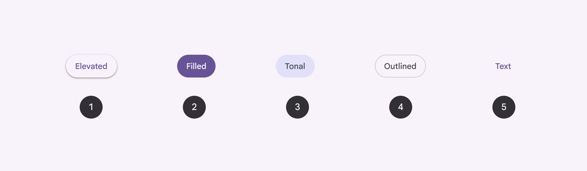
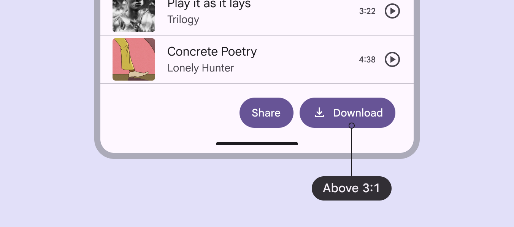
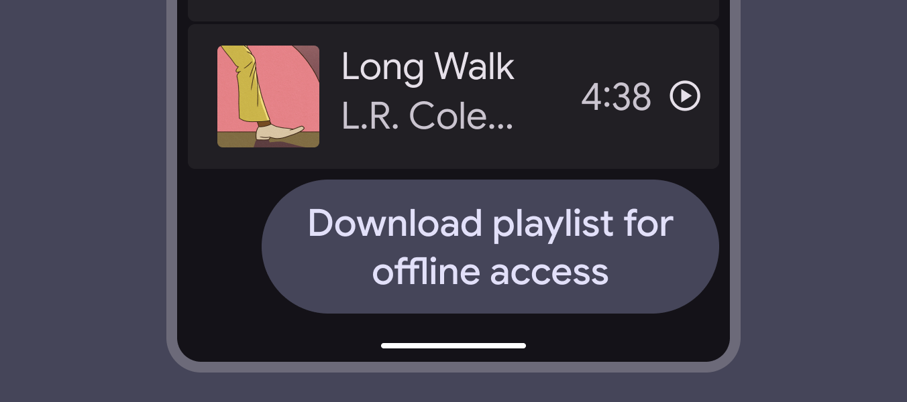

按钮的尺寸不只是“看起来够大”，它还要为两件事留余地：手指的误差，以及文字被放大后的呼吸。Material Design 在按钮规范里把样式分成 elevated、filled、tonal、outlined、text 等层级，但真正值得注意的细节，是这些样式并不是为了让按钮更花，而是让主次动作在一眼之内被分开。

常见误区是把按钮当成一个固定胶囊：字号、圆角、内边距在视觉稿里刚好，于是界面看上去很整齐。但真实使用里，用户可能打开 200% 文字大小，文案可能从两个字变成一句话，按钮也可能出现在拥挤的底部栏里。此时如果只追求“紧凑”，按钮会先失去阅读性，再失去可点击性。

Material 的 accessibility 文档提醒：可用按钮与背景至少需要 3:1 的对比；按钮标签在 Android 上放大到 200% 后，应尽量避免过度换行或被截断。这个要求看似偏工程，实则是很基础的视觉秩序：按钮应该在状态变化、字号变化、语言变化后，仍然像一个稳定的动作入口。

所以设计按钮时，先不要问它够不够“精致”，而要问它有没有保留余量：文案能否更短，内边距能否承受放大，主按钮是否真的只留给最重要动作，次级动作是否安静但仍可辨认。克制不是把按钮做小，而是让它在压力场景里不慌。

**追问：** 当前界面里最重要的那个按钮，如果文字放大到 200%，它还能保持清楚、稳定、可点击吗？

> [!quote] 参考资料
> - [Material Design 3: Buttons overview](https://m3.material.io/components/buttons/overview)
> - [Material Design 3: Buttons accessibility](https://m3.material.io/components/buttons/accessibility)
> - [WCAG 2.2: Target Size (Minimum)](https://www.w3.org/WAI/WCAG22/Understanding/target-size-minimum.html)
> - [WCAG 2.2: Resize Text](https://www.w3.org/WAI/WCAG22/Understanding/resize-text.html)
