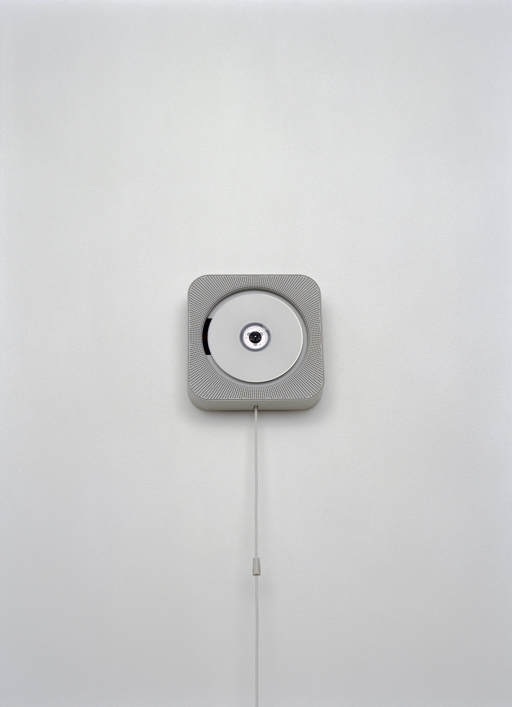

深泽直人的“Without Thought”不是把产品做得安静，而是让使用者在还没有开始思考说明书之前，身体已经知道下一步该做什么。它的重点不是造型上的“无感”，而是把动作、位置、重量和日常经验调到同一条线上。

MUJI 的壁挂式 CD 播放器是一个很好的切片：它不把“播放”做成一个需要寻找的按钮，而是借用了换气扇拉绳的经验。拉一下，声音开始；再拉一下，声音停止。这个动作本身已经包含反馈和状态切换，所以产品不需要大声解释自己。

±0 的加湿器也类似。它像一只低矮的水盆，开口、体量和圆润边缘都在提示“这里和水有关”。好的克制不是删除特征，而是保留最接近日常经验的那个特征，让它承担交互说明。

迁移到界面设计里，这意味着不要急着给每个功能加一层解释文案或新手引导。先问：这个动作能不能从位置、形状、状态和前后关系里被感觉到？例如可拖拽区域是否真的像可以移动，保存状态是否在编辑节奏中自然出现，危险操作是否在距离和确认方式上显得“更重”。

误区是把“无意识”误解成“没有提示”。深泽直人的安静并不是含糊，而是把提示藏进熟悉动作里。界面如果只是变得更空、更浅、更少文字，却没有让行为路径更自然，就只是把理解成本转嫁给用户。

**追问：** 一个功能如果去掉说明文字，只靠位置、状态和动作反馈，还能被正确使用吗？如果不能，缺的究竟是文案，还是行为线索？

> [!quote] 参考资料
> - [Naoto Fukasawa Design — About](https://naotofukasawa.com/en/about/)
> - [Naoto Fukasawa Design — Wall mounted CD Player](https://naotofukasawa.com/en/projects/540)
> - [Naoto Fukasawa Design — Humidifier](https://naotofukasawa.com/en/projects/365)
