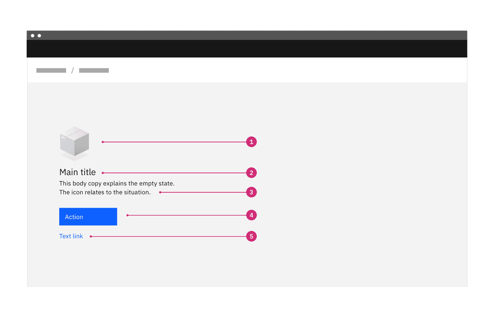
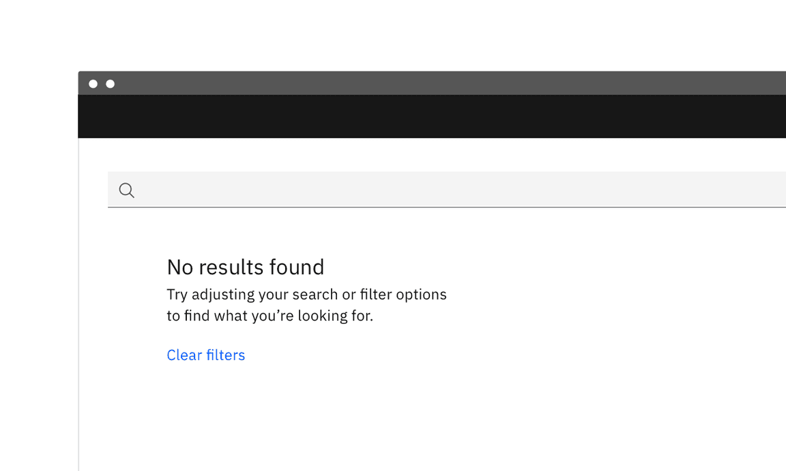

空状态最常见的误区，是把“没有内容”当成一个需要被装饰的洞：放一张可爱的插画、写一句轻松的话，然后结束。这样看起来比空白友好，却没有回答用户真正紧张的问题：这里为什么是空的？系统是否已经完成？下一步能做什么？

Carbon Design System 对空状态的定义很直接：它是应用中没有数据显示给用户的时刻，但它应该让用户保持被告知、被支持，并回到一条可继续前进的路径。也就是说，空状态不是视觉缓冲区，而是一段很短的产品说明书。

反面做法通常有三种。第一，只说“这里什么都没有”，但不说明这是首次使用、筛选无结果、权限不足，还是加载失败。第二，把主要篇幅给插画和品牌语气，却不给行动入口。第三，在搜索或筛选场景里不保留用户刚才的条件，让人不知道该改哪里。

更好的空状态通常只需要四个层次：状态说明、原因或条件、下一步动作、必要时给一个轻量学习线索。它不一定要热闹，也不一定要极简；关键是把“不在场的内容”翻译成“用户现在可以理解和处理的关系”。

在界面设计里，空不是留白本身，而是一种未完成的对话。留白可以安静，但不能让用户独自猜测。

**追问：** 当前界面里有没有某个“空白区域”，其实应该回答用户的一个具体问题，而不是只负责好看？

> [!quote] 参考资料
> - [Carbon Design System: Empty states](https://carbondesignsystem.com/patterns/empty-states-pattern/)
> - [Nielsen Norman Group: Designing Empty States in Complex Applications](https://www.nngroup.com/articles/empty-state-interface-design/)
> - [Material Design 2: Empty states](https://m2.material.io/design/communication/empty-states.html)
