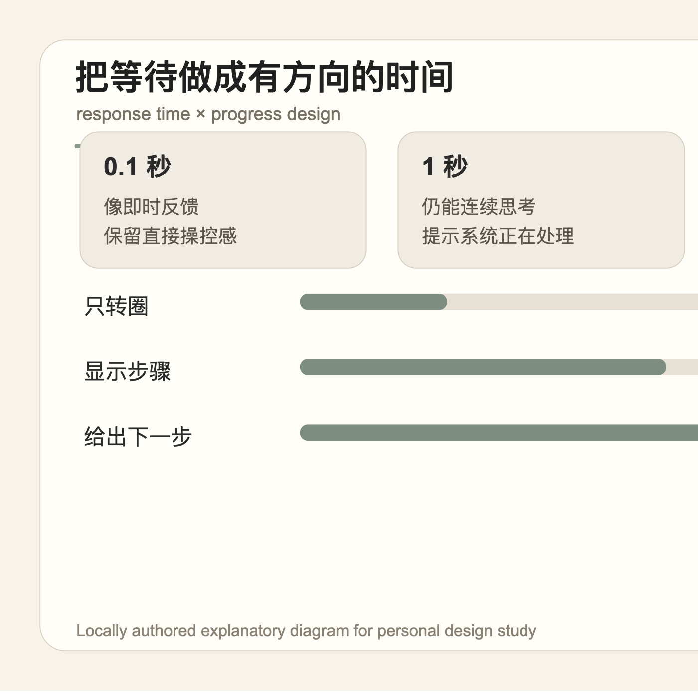

等待不是界面的空白时间，而是一段仍然需要被设计的体验。真正糟糕的等待，不只是慢，而是让人不知道系统是否听见、正在做什么、还有没有下一步。

很多产品把 loading 当成一个视觉占位：放一个 spinner，或者加一点动效，就以为完成了反馈。但 spinner 只回答了“系统没死”，没有回答“正在处理哪件事”“大概要经过几个阶段”“我现在能不能离开”。当等待超过一两秒，用户失去的不是耐心，而是对关系的判断。

更好的等待设计会把时间拆成方向感。比如上传、导入、付款、生成报告这类流程，界面可以告诉用户当前处在“校验文件 / 上传 / 处理 / 完成”中的哪一步；如果无法给出准确百分比，也至少可以给出状态文本、预计范围、可取消路径，或完成后会发生什么。

这里的克制不是让 loading 更安静，而是让它少表演、多交代。一个细小的状态句，有时比一段精致动画更能安抚人，因为它恢复了用户对系统的理解权。

**追问：** 当一个界面必须让人等待时，它现在只是在“装饰时间”，还是在帮助用户理解这段时间的方向？

> [!quote] 参考资料
> - [Nielsen Norman Group: Response Times: The 3 Important Limits](https://www.nngroup.com/articles/response-times-3-important-limits/)
> - [Material Design 3: Progress indicators](https://m3.material.io/components/progress-indicators/overview)
> - [Carbon Design System: Progress indicator](https://carbondesignsystem.com/components/progress-indicator/usage/)
