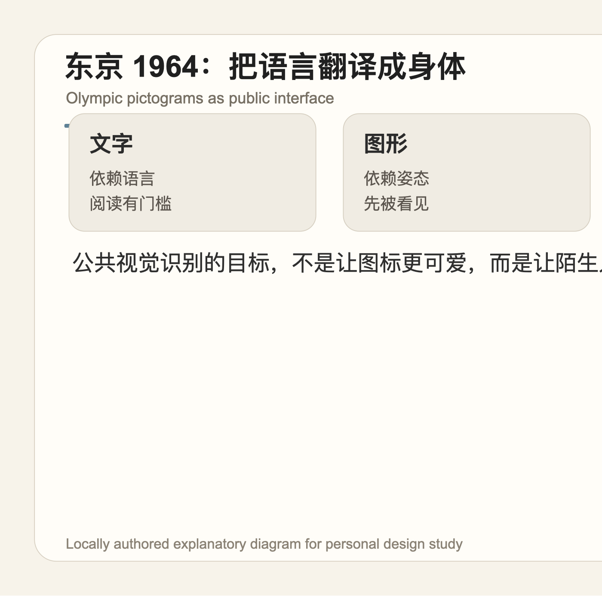
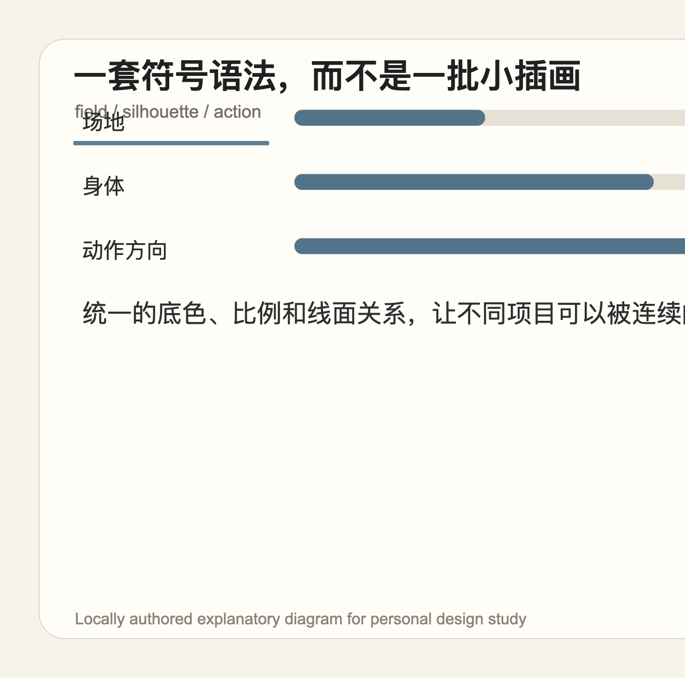
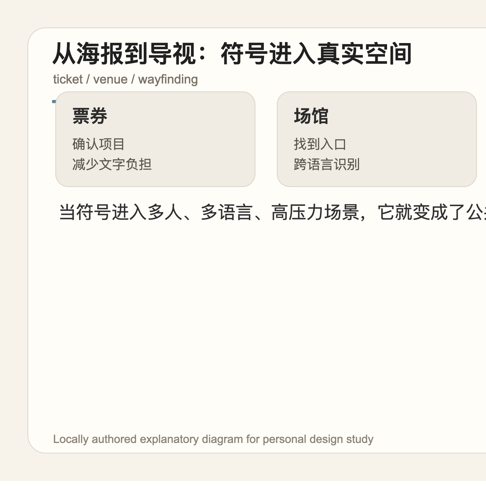
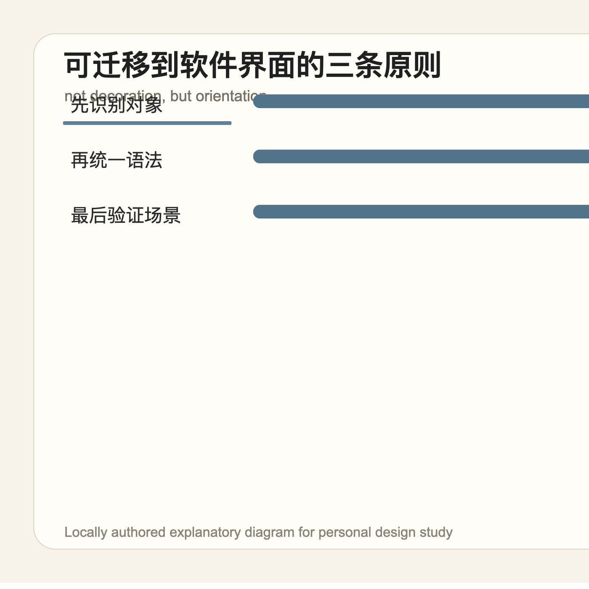

## 一句话结论

1964 年东京奥运会的图形符号价值，不在于“画得简洁”，而在于它把一场国际赛事中复杂的语言、场馆和行动问题，翻译成一套可以被快速识别的身体语法。

## 研究对象

东京 1964 常被视为现代奥运视觉传播的重要转折点之一。它面对的不是单一海报问题，而是一个更接近今天产品设计的问题：大量来自不同国家的人，需要在陌生城市、陌生场馆、不同语言之间迅速理解“这是什么”“往哪里走”“该做什么”。

在这种场景里，文字会变慢，装饰会变吵。图形符号之所以重要，是因为它把信息从语言层降到感知层：先看见一个动作，再理解一个项目；先识别一个方向，再决定下一步。

## 背景

体育项目本身很适合被符号化，因为它们有清晰的身体姿态：游泳、射箭、体操、摔跤，都能通过轮廓、重心和动作方向被压缩成图形。但难点也正在这里：如果每个项目都只是各画各的“小人”，系统会很快变成插画集合，而不是公共信息系统。

东京 1964 的启发，是把图形当作一套语法来处理：相近的比例、稳定的正负形关系、明确的动作重心、统一的黑白/底色逻辑，让不同项目在同一张地图、票券、导视牌里仍然属于同一个世界。

## 代表画面 / 关键机制

第一层是轮廓。好的公共符号通常不依赖细节，而依赖“剪影是否成立”。哪怕缩小、远看、印刷质量下降，只要轮廓仍然能区分，信息就还活着。

第二层是动作。体育图标不是静物，它要抓住一个项目最能被认出的姿态：弓被拉开的方向、跳水身体的弧线、赛跑的前倾。动作越准确，符号越不需要解释。

第三层是系统。单个图标可以漂亮，但公共设计关心的是几十个符号放在一起时是否仍然安静、稳定、可预测。真正的克制不是每个图标都少画一点，而是每个图标都服从同一套判断秩序。

## 视觉 / 交互语言

这套思路很像今天的软件界面：图标不是装饰，而是导航、状态和动作的入口。一个“上传”“同步”“警告”“权限”图标如果只追求风格统一，却没有抓住对象、状态和后果，用户仍然需要读文字才能确认。

因此，图标系统的审美不应只问“是否好看”，还要问三个更朴素的问题：弱注意力下能否被认出？不同尺寸下是否仍然成立？和文字、颜色、位置放在一起时，是在帮助判断，还是在制造第二套噪音？

## 可迁移原则

1. **先找最小可识别姿态。** 图标设计不是把对象画全，而是找到最少多少信息仍然能让人认出它。
2. **把风格降级为语法。** 真正可持续的图标系统，靠比例、线面、圆角、空隙、方向这些规则保持一致，而不是靠“看起来同一种风格”。
3. **在真实压力里验证。** 公共导视要面对距离、速度、拥挤和跨语言；软件图标也要面对小尺寸、低耐心、深色模式、禁用态、错误态和新用户。
4. **不要让图标替代必要文字。** 符号可以降低第一眼成本，但复杂动作、危险后果、不可逆操作仍然需要文字确认。克制不是取消说明，而是让说明出现在最需要的位置。

东京 1964 给今天界面设计的提醒是：一个优秀图标系统不是“更漂亮的一批 icon”，而是一种把复杂环境变得可行动的秩序。它安静，但不是空；它简化，但不是省略责任。

## 参考资料

- [The Olympic pictograms: a century of tradition and innovation](https://olympics.com/en/news/the-olympic-pictograms-a-century-of-tradition-and-innovation)
- [Tokyo 1964 Olympic Design Programme](https://www.olympics.com/ioc/olympic-games/tokyo-1964)
- [Lance Wyman: Mexico 68 and pictogram systems](https://www.lancewyman.com/projects/olympics-mexico-1968/)
