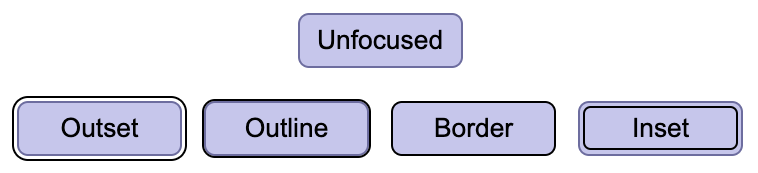

键盘焦点不是可访问性清单里的一圈蓝线，而是界面给用户留下的“当前位置”。当鼠标离开、触控不存在、或用户只能用 Tab 键移动时，焦点边界就是唯一的空间线索：现在在哪里，按下 Enter 会发生什么，下一步会去哪里。

很多界面会把 hover 做得很细，却把 focus 处理得很弱，甚至直接 `outline: none`。这看似让画面更干净，实际是把操作路径擦掉了。对键盘用户来说，一个没有焦点的按钮并不是“更极简”，而是不可确认；一个只改变阴影或浅灰背景的输入框，也很容易在高亮主题、深色模式、低视力场景里消失。

好的焦点状态不一定刺眼，但必须足够明确。W3C 在 WCAG 2.4.7 里强调“用户知道哪个元素拥有键盘焦点”，在 2.4.13 里进一步把问题从“有没有”推进到“是否足够看得见”：焦点区域至少要接近 2px 周长的面积，并与相邻状态有足够对比。Carbon 的键盘指南也把焦点和 Tab 顺序放在一起谈，因为焦点不是孤立样式，而是一条可预测的路径。

界面设计里可以把焦点当成一种安静的边界设计：它不抢主视觉，但在需要时立刻出现；它不改写组件性格，但清楚告诉用户“此刻这里可操作”。尤其在按钮组、菜单、标签页、表格单元这些密集区域，焦点边界要比 hover 更可靠，因为它承载的是行动确认，而不是装饰反馈。

一个实用判断是：把鼠标收起来，只用 Tab、Shift+Tab、Enter 和 Space 走一遍主要流程。如果眼睛需要停下来猜当前位置，焦点就太弱；如果焦点顺序跳跃、绕远或进入不可见区域，问题就不只是样式，而是信息架构没有尊重操作路径。

**追问：** 当前界面里，哪些“看起来更干净”的处理，其实是在删除用户确认位置的线索？

> [!quote] 参考资料
> - [W3C WAI：Understanding SC 2.4.7 Focus Visible](https://www.w3.org/WAI/WCAG22/Understanding/focus-visible.html)
> - [W3C WAI：Understanding SC 2.4.13 Focus Appearance](https://www.w3.org/WAI/WCAG22/Understanding/focus-appearance.html)
> - [Carbon Design System：Accessibility / Keyboard](https://carbondesignsystem.com/guidelines/accessibility/keyboard/)
