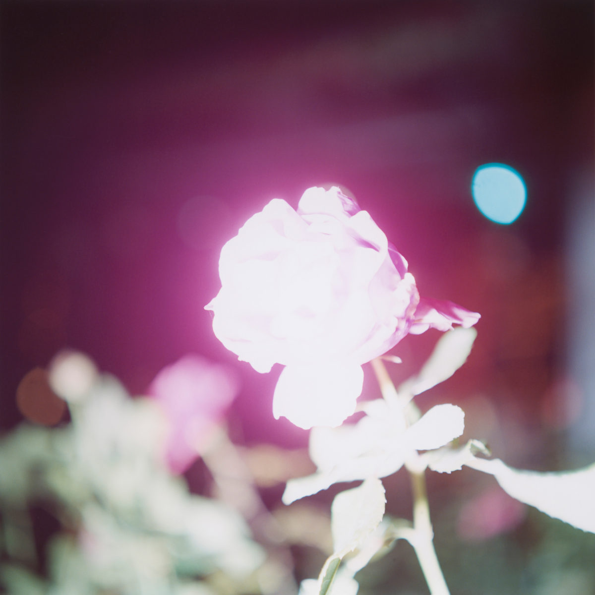
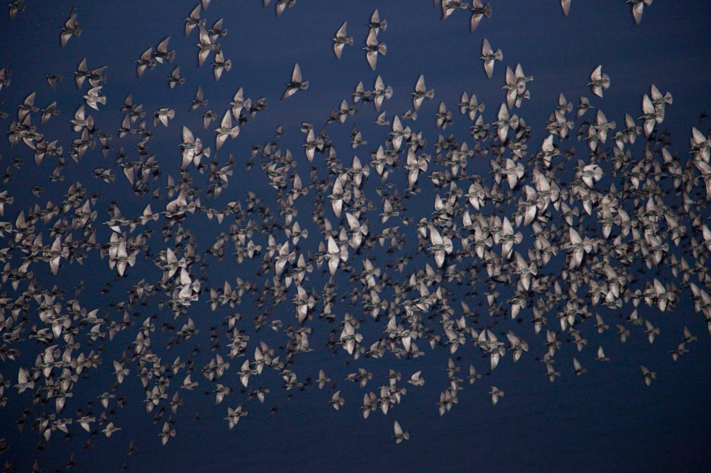
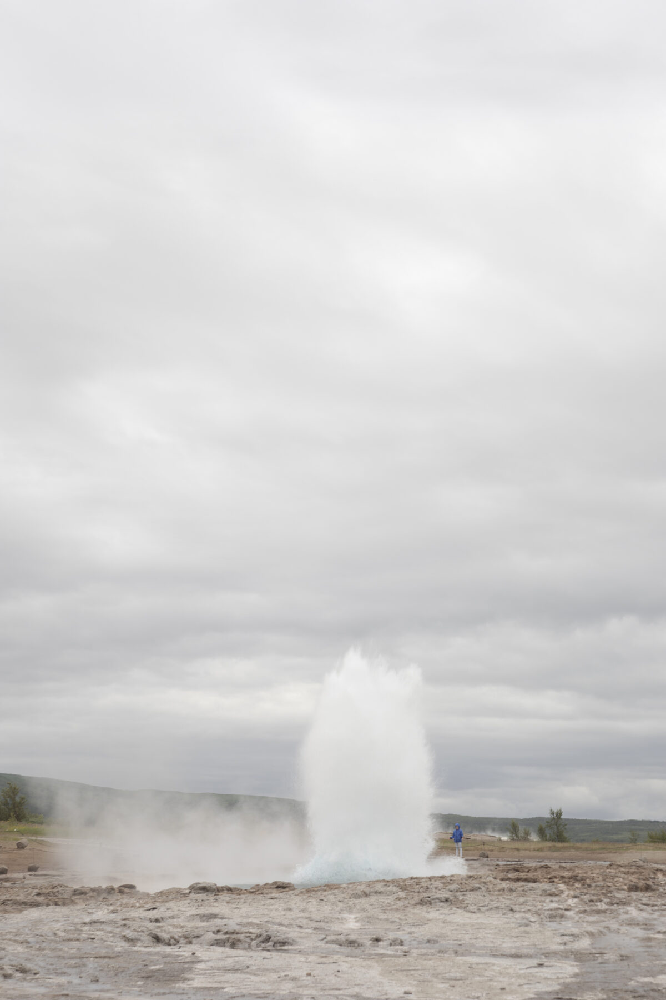

川内伦子的照片常被形容为“温柔”，但真正值得借鉴的不是柔和色调，而是她把日常碎片组织成秩序的方式：光、留白、局部、短暂动作，都不是气氛装饰，而是在替画面建立观看路径。

在《Illuminance》这样的作品里，很多画面并不急于交代完整事件。它只截取一束光、一块皮肤、一只动物、一个反射面，让观看者先感到“有什么正在发生”，再慢慢补足关系。这种克制不是信息不足，而是把解释权从说明文字交还给感知。

这对界面设计也有提醒：很多页面失败，不是因为内容不够，而是因为所有内容都用同一种声量出现。川内伦子的照片像是在说，秩序可以来自轻重、距离和停顿。一个界面不一定要把每个模块都做成卡片、描边、标题和按钮；有时只要让主要动作更清楚，让次要信息退后，让空白承担呼吸，结构就会浮出来。

但不要把这种方法误解成“调淡一点”。柔和只是结果，关键是选择：留下哪个瞬间，省略哪部分上下文，让观看者在哪里停住。做作品集、产品页或摄影叙事时，真正可迁移的原则是：**先建立观看的节奏，再安排信息的完整性**。

**追问：** 一个页面里，哪些信息其实不需要立刻被解释，而应该先被“感觉到”？

> [!quote] 参考资料
> - [Rinko Kawauchi Biography](https://rinkokawauchi.com/en/biography/)
> - [Rinko Kawauchi Works](https://rinkokawauchi.com/en/works/)
> - [Rinko Kawauchi — Illuminance](https://rinkokawauchi.com/en/works/194/)
> - [Rinko Kawauchi — Halo](https://rinkokawauchi.com/en/works/172/)
> - [Rinko Kawauchi — M/E](https://rinkokawauchi.com/en/works/1475/)
