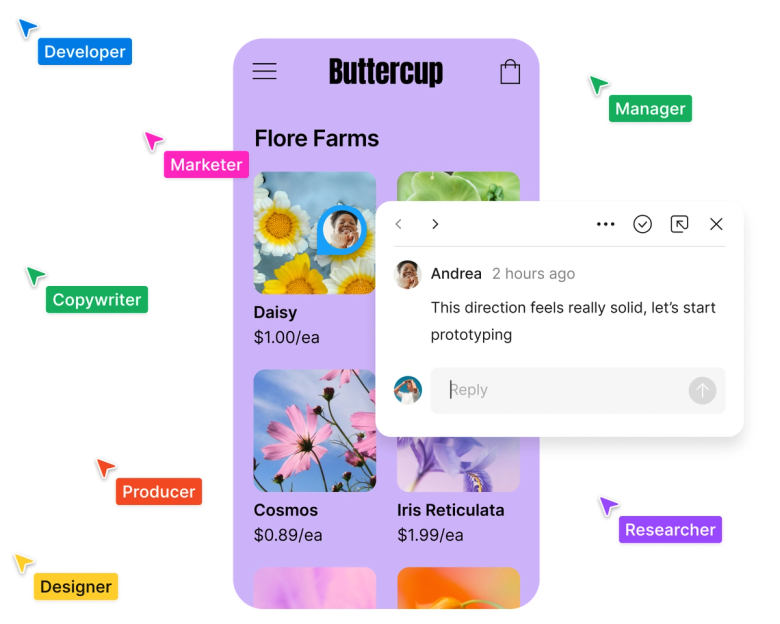
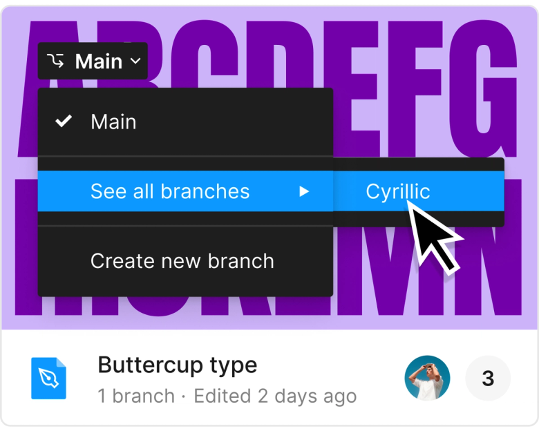

Figma 的多人协作界面值得观察的地方，不是“很多人同时在线”这件事本身，而是它把远端的人变成了可感知、可定位、可回应的现场。协作如果只停留在权限、版本和消息列表里，人会不断失去上下文；Figma 选择把协作直接放回画布。

彩色光标、姓名标签、评论气泡这些元素看起来很轻，却解决了三个关键问题：谁在这里、他正在看哪里、这件事和哪个对象有关。它们没有另开一个“协作中心”，而是贴着被讨论的对象出现，让反馈不脱离材料本身。

这也是 Figma 与许多传统设计工具的分界：协作不是完成设计之后的审批流程，而是设计过程中的一层空气。颜色让人被识别，位置让意图被理解，评论让决定留下痕迹。界面因此不需要把所有沟通都写成正式文档，仍然能维持基本秩序。

可迁移的原则是：多人系统里的“ presence ”不能只是在线头像。真正有用的存在感，要靠位置、动作、对象关系和状态共同构成。做协作型产品时，与其增加更多通知，不如先问：用户能不能在当前工作表面上，直接感到别人正在怎样参与？

但这件事也有边界。存在感太强会变成干扰，颜色、动效和提示如果持续抢眼，工作材料反而退到后面。好的协作提示应该像房间里的脚步声：足够让人知道有人在场，又不会替代正在进行的工作。

**追问：** 一个协作界面里，哪些信息必须贴在对象旁边，哪些信息应该退到历史记录或通知里？

> [!quote] 参考资料
> - [Figma Design](https://www.figma.com/design/)
> - [Figma: The Collaborative Interface Design Tool](https://www.figma.com/)
