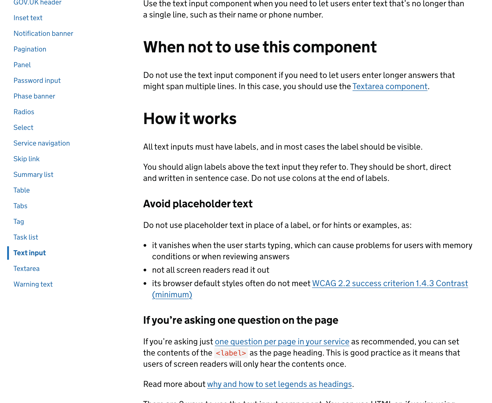
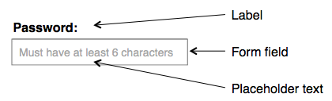
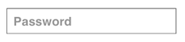

把表单标签放进输入框里，看起来是在节省空间，实际是在把说明交给记忆。placeholder 最大的问题不是“不够美”，而是它会在用户开始输入后消失；当人需要复查、修改、处理报错，或被打断后回来继续填写时，原本应该稳定存在的上下文已经不见了。

NN/g 把这种做法说得很直接：placeholder 可以作为补充提示，但不应该替代 label。GOV.UK Design System 也要求文本输入必须有标签，并且大多数情况下标签应该可见。这里的“可见”不是视觉保守，而是一种界面责任：字段名、填写内容和错误修复路径，需要在同一个现场同时成立。

常见误区是把“页面更干净”理解成“文字更少”。但表单不是海报，它的美感来自确认感：用户扫一眼能知道每个字段在问什么，输入后还能检查自己填得对不对。尤其在地址、证件、付款、报名这类低频任务里，隐藏标签会让用户为设计的留白付出额外认知成本。

更稳的做法是：label 放在输入框上方，保持短、直接、句子式；placeholder 只在确实需要示例时作为次级提示；复杂说明放到 hint text，而不是塞进框内。留白应该保护判断，而不是拿走判断所需的线索。

**追问：** 如果把一个表单填满以后再回头检查，哪些字段即使内容已经输入，也仍然能让人立刻知道“这里原本在问什么”？

> [!quote] 参考资料
> - [GOV.UK Design System: Text input](https://design-system.service.gov.uk/components/text-input/)
> - [Nielsen Norman Group: Placeholders in Form Fields Are Harmful](https://www.nngroup.com/articles/form-design-placeholders/)
> - [W3C WCAG 2.2: Contrast (Minimum)](https://www.w3.org/TR/WCAG22/#contrast-minimum)
