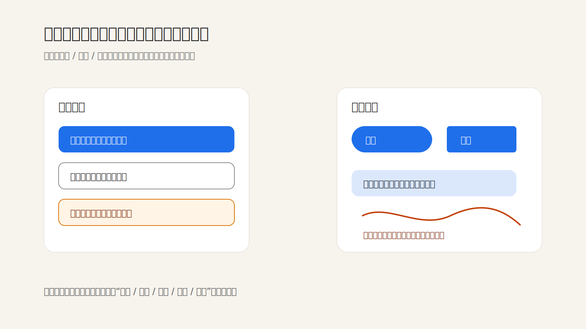

一致性不是把每个页面做得一样，而是让相同的关系在不同场景里保持相同形状。真正需要稳定的，不是颜色、圆角或某个组件外观，而是用户对“这是主操作”“这是风险”“这里可返回”“这个状态还没完成”的判断方式。

Material Design 把状态分成 hover、focus、pressed、dragged、disabled 等，是因为界面里的“可操作性”需要一套可学习的语法。NN/g 谈一致性与标准时也强调：一致性能减少重新学习，让用户把注意力放回任务本身。

所以一致性不是视觉保守，而是认知节省。比如同一个产品里，危险操作有时是红色文字，有时是蓝色实心按钮，有时藏在更多菜单里；单看每一处都可能不丑，但合在一起会让用户每次都重新判断风险。相反，主要、次要、危险、禁用、完成这些关系如果有稳定的形状，界面即使密度很高，也会显得安静。

需要避免的是“表面统一”：所有按钮都同色、所有卡片都同尺寸、所有页面都套同一个模板。这样的统一会抹平关系，反而让真正重要的差异变得不清楚。好的系统应该允许内容变化，但不允许关系随意漂移。

**追问：** 把界面里的文字暂时遮住后，是否还能看出哪些是主要动作、哪些是风险状态、哪些只是辅助信息？

> [!quote] 参考资料
> - [Material Design 3: States](https://m3.material.io/foundations/interaction/states/overview)
> - [Nielsen Norman Group: Consistency and Standards](https://www.nngroup.com/articles/consistency-and-standards/)
