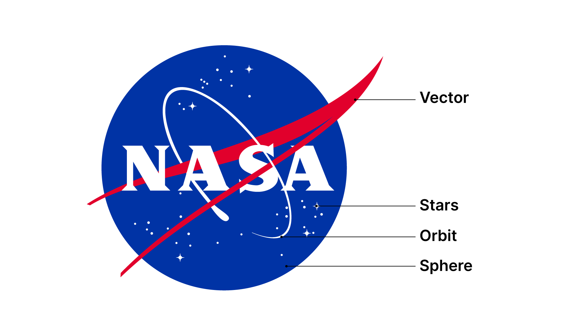
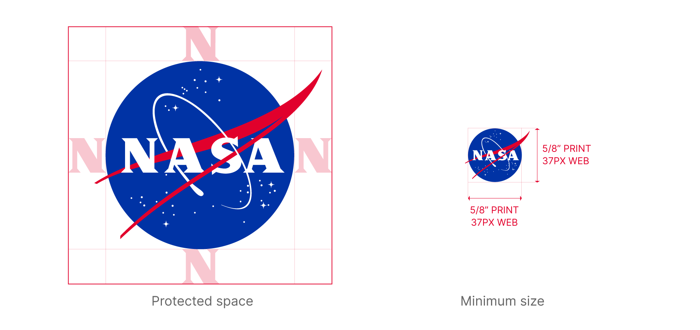
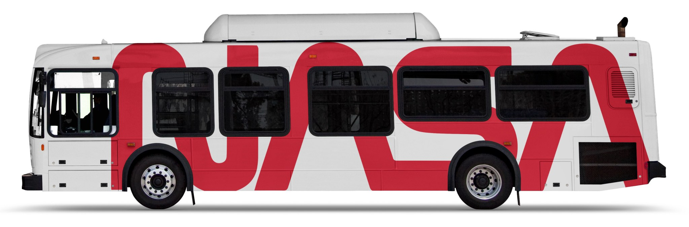
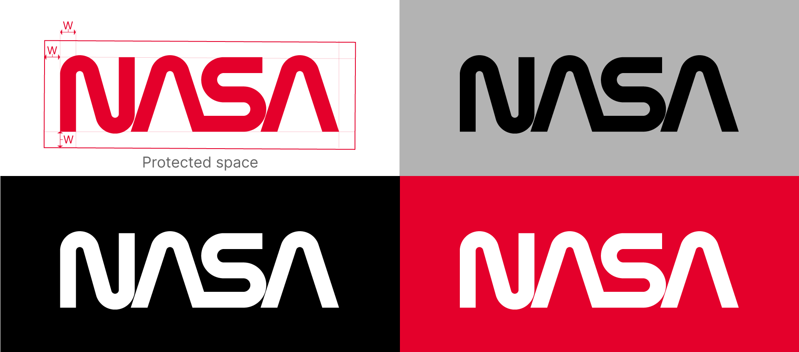
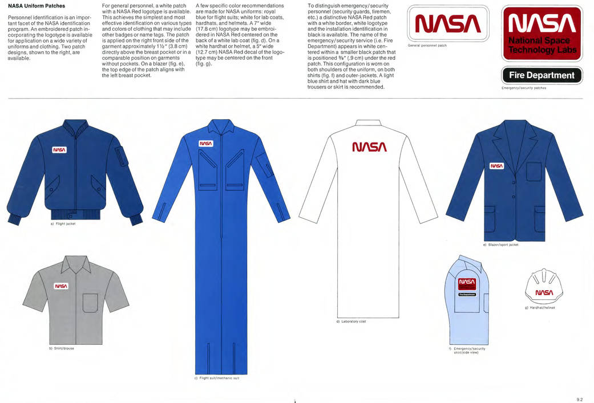

## 一句话结论

NASA 的视觉识别真正值得研究的地方，不只是“worm”标志看起来很未来，而是它把未来感翻译成了一套可执行的规范：尺寸、留白、颜色、字体、车辆、建筑、出版物、标牌，都被放进同一个通信系统里。好的品牌不是一张漂亮图形，而是一种让组织持续说同一种话的秩序。

## 研究对象

1975 年，Richard Danne 与 Bruce Blackburn 为 NASA 设计了新的 Logotype，也就是后来常被称为 “worm” 的 NASA 字标。1976 年发布的《NASA Graphics Standards Manual》把它扩展成完整的视觉通信系统。NASA 现在的品牌指南也明确记录：worm 在 1976–1992 年间是官方标志，之后可作为与 “meatball” 徽章并置的补充图形使用；同时，NASA 对这些标志的使用有严格限制。

这里的重点不在于复古字体，也不在于把四个字母连成连续线条这件事本身。更值得拆解的是：一个国家级机构如何把“探索未来”这种抽象气质，落到普通人每天会遇到的界面——车辆编号、办公标识、任务资料、建筑外立面、出版物封面、制服与设备标记。

## 背景

NASA 原有的 “meatball” 徽章包含星体、轨道、矢量和球体，信息丰富，也带有明显的时代象征。它有叙事感，但在复杂媒介里会遇到一个问题：图形细节多，应用尺寸、背景和工艺稍有变化，识别就容易变浑。

Danne 与 Blackburn 的 worm 反过来走向“少”。它没有画火箭，也没有画星球，只保留 NASA 四个字母的几何连续性。这个动作并不是把品牌变冷，而是把 NASA 从一枚徽章变成一种可部署的信号：远看是一条红色节奏，近看才读出字母。

## 代表作品 / 关键画面

第一类关键画面，是手册里的规范页。保护空间、最小尺寸、颜色、背景对比、居中方式，这些看似枯燥，却决定了标志能不能在真实环境里保持尊严。NASA 当前品牌指南甚至提醒：meatball 并不是完全对称的，居中时应以蓝色球体为准，而不是把整个物件机械居中。这里体现的是一种很细的视觉判断——规范不是为了束缚设计师，而是为了避免每一次落地都重新争论。

第二类关键画面，是 worm 被放到巴士、飞机、建筑和资料上的应用。红色字标在白色车身上不是装饰，它像一个公共系统的签名：清楚、直接、低解释成本。它没有把“太空”视觉化成星空背景，而是让组织本身呈现出工程感、速度感和现代性。

第三类关键画面，是 logotype 的保护空间。很多标志在展示稿里很好看，一进入真实页面就被标题、照片、按钮、边框挤压。NASA 手册把留白变成可测量的空间，这一点很重要：**留白不是审美偏好，而是识别系统的呼吸权。**

## 视觉 / 交互语言

worm 的语言很明确：连续线、圆角转折、低细节、高速度。它的未来感不是来自炫技，而是来自减少摩擦。字母之间的连接让它不像一组排版文字，更像一个可被喷涂、贴附、缩放、移动的工程符号。

这和界面设计很接近。一个按钮、状态标签、导航栏或数据卡片，如果只在单屏稿里好看，还不能算成熟。它必须能承受不同长度的文字、不同背景、禁用态、错误态、移动端窄屏、深色模式和权限差异。NASA 手册的价值就在于，它把“看起来统一”推进到“可以被不同团队稳定执行”。

## 可迁移原则

第一，先定义关系，再定义风格。NASA 的规范不是先问“要不要更酷”，而是先回答：徽章、字标、部门名称、车辆编号、背景色、出版物标题之间是什么关系。界面设计也一样，主操作、次操作、危险操作、系统反馈、空状态、导航层级需要先形成关系语法，之后再谈视觉情绪。

第二，未来感可以很安静。真正耐看的现代感，往往不是更多渐变、发光和三维材质，而是更少的解释成本。worm 的力量来自可识别的轮廓和稳定的部署方式，不是来自复杂装饰。

第三，把留白写进规则。很多设计失败不是因为元素不好看，而是因为元素没有保护区：标志贴边、按钮太挤、表单提示贴得太近、卡片之间没有节奏。留白一旦只是“凭感觉”，就很容易在交付时被压缩掉；留白一旦成为规则，系统才有长期一致性。

第四，不要表面模仿。把一个 SaaS 产品做成红色 worm 风格，通常只是复古表演。真正可借鉴的是它的系统思维：少量核心形状，明确的使用限制，可测量的空间，跨媒介的执行方式，以及对误用场景的提前预防。

## 追问

如果一个产品或作品集只能保留三条视觉规范，哪三条最能保护它在不同页面、不同设备、不同内容长度下仍然像同一个系统？

## 参考资料

- [NASA Brand Guidelines](https://www.nasa.gov/nasa-brand-center/brand-guidelines/)
- [NASA Graphics Standards Manual - NASA](https://www.nasa.gov/image-article/nasa-graphics-standards-manual/)
- [NASA Graphics Standards Manual (1976) PDF](https://www3.nasa.gov/sites/default/files/atoms/files/nasa_graphics_manual_nhb_1430-2_jan_1976.pdf)
