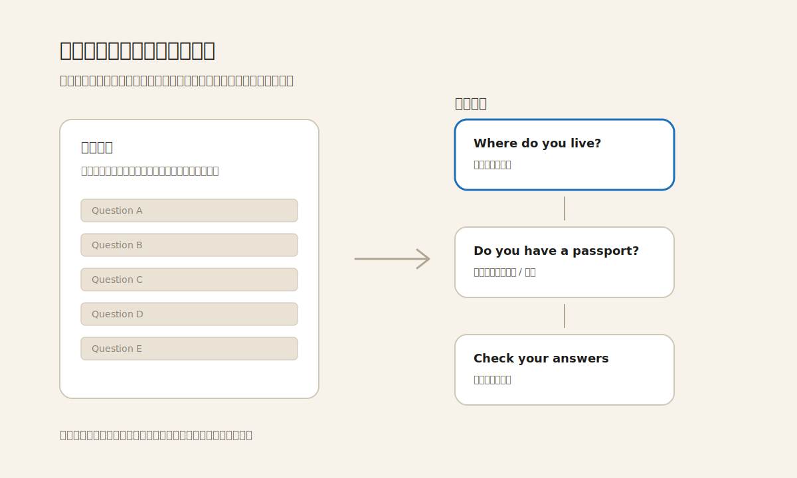

GOV.UK 的“一页一件事”不是把表单做得更长，而是把每一次判断变得更轻。好的数字服务不应该把纸面表格原样搬到屏幕上；屏幕的优势在于可以按顺序提问、按答案分支、只在需要时出现下一步。

这个做法的关键不是“每页只有一个输入框”这么机械，而是每一页都形成一个完整的小场景：一个清楚的问题、必要的说明、可操作的答案、继续或返回的路径。用户不必一边读十几个字段，一边猜哪些与自己有关；系统承担了排序、分支和排除无关问题的责任。

它也解释了为什么有些“极简表单”并不真正简单。视觉上字段少，如果问题本身含糊、上下文不够、返回路径不清楚，用户仍然会停住。相反，一页一个问题可以看起来更慢，却让每一步更确定：当前要回答什么、为什么要回答、答完会去哪里，都在同一个注意力范围里。

迁移到产品界面时，可以把它理解成一种节奏设计：不要把用户需要做的判断一次性摊开，而是让界面按照意图成熟的顺序出现。设置向导、权限申请、风险确认、复杂筛选、开户/报名流程都适用。真正需要警惕的是为了追求“少页数”把无关字段合并到一起，结果省下的是系统页面，增加的是人的犹豫。

**追问：** 当前正在设计的流程里，哪些字段或选项只是因为“同属一个表单”才被放在一起，而不是因为用户会在同一刻做出同一个判断？

> [!quote] 参考资料
> - [GOV.UK Service Manual: Structuring forms](https://www.gov.uk/service-manual/design/form-structure)
> - [GOV.UK Design System: Question pages](https://design-system.service.gov.uk/patterns/question-pages/)
