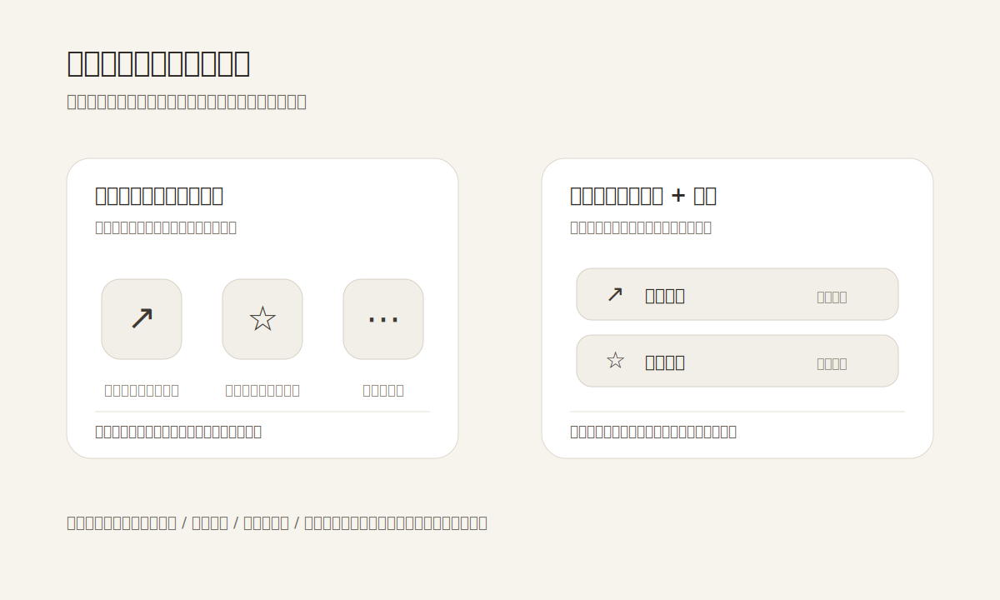

把界面做“干净”时，最容易犯的一个错误，是把文字拿掉，只留下图标。问题不在于图标不好，而在于很多图标并没有稳定到可以独自承担动作说明：一个箭头可能是分享、打开、跳转；一颗星可能是收藏、评分、推荐；三个点可能是更多操作，也可能只是把犹豫藏起来。

图标的价值是加速识别，不是替代命名。真正熟练的用户会先读形状，但大多数人在关键操作前仍需要一句短文字来确认：这到底会发生什么。尤其是低频功能、跨文化图形、破坏性动作、支付/发布/权限相关动作，只用符号会把界面的不确定性转嫁给用户。

克制的设计不是把所有字都删掉，而是让文字只出现在会降低判断成本的位置。常见做法可以很轻：主操作用“图标 + 动词”，工具栏里的高频图标保留 tooltip 和可访问名称，危险操作不要只给垃圾桶图标，而要让“删除”“移除”“清空”这些不同后果被明确区分。

也不要把 tooltip 当成万能补丁。tooltip 通常需要 hover 或 focus 才出现，在触屏、紧张操作、快速扫视时并不等于可见说明。它适合补充，不适合承担主信息。一个更稳的判断方法是：如果用户必须先停下来猜图标，再用 tooltip 验证猜测，那这个图标其实已经在拖慢任务。

**追问：** 当前界面里有哪些图标按钮，一旦遮住旁边的文字或提示，就会让人无法确定下一步后果？

> [!quote] 参考资料
> - [Nielsen Norman Group: Icon Usability](https://www.nngroup.com/articles/icon-usability/)
> - [Material Design 3: Tooltips](https://m3.material.io/components/tooltips/overview)
> - [W3C WCAG Understanding SC 1.1.1: Non-text Content](https://www.w3.org/WAI/WCAG22/Understanding/non-text-content.html)
