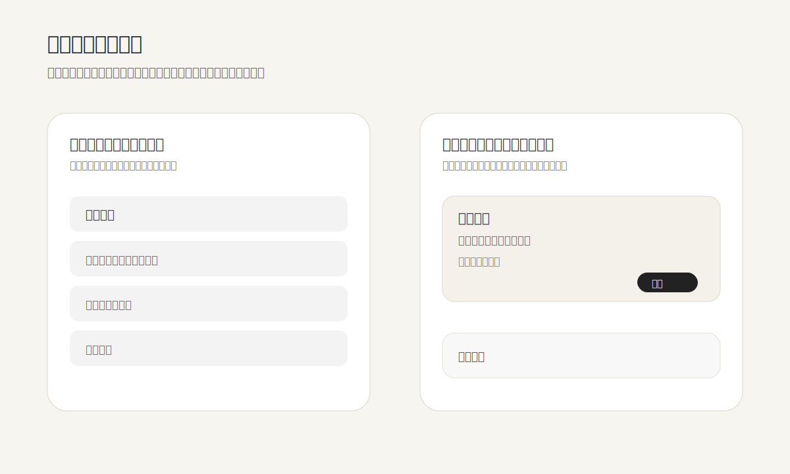

界面里的距离不是“留白多一点就高级”，而是一种比线框、卡片和标题更早被看见的关系语言。相近的元素会被自然读成一组；距离拉开，才表示这是另一件事。好的分组，应该让眼睛先理解关系，再去读文字。

这也是格式塔接近律在产品界面里的实际价值。一个设置项如果把标题、说明、状态和按钮放得太散，用户会先看到四个零件；如果它们在一个合适的近距离里聚合，再与下一个设置项保持更大的间隔，用户会先看到“一个可处理的对象”。判断成本会明显下降。

很多界面的问题不是缺少分割线，而是距离没有层级：卡片内外用同一种间距，标题和说明像陌生人，不同模块又靠得太近。于是设计只能不断补边框、补背景、补阴影。真正更克制的做法，是先建立空间比例：组内近，组间远；同级一致，不同级拉开；重要动作离所属内容近，危险动作则通过距离和确认方式变重。

Carbon Design System 把 spacing 当作产品设计里经常被低估的基础，并用 token 让距离在组件内部、组件之间和页面布局里保持一致。这个思路比“凭感觉调 8px 或 16px”更可靠：距离一旦成为系统，团队就能稳定表达相同的信息关系，而不是每个页面重新发明秩序。

**追问：** 当前正在设计的页面里，有没有某些关系本可以靠距离说明，却被迫用线、卡片、图标或说明文字来补救？

> [!quote] 参考资料
> - [Law of Proximity | Laws of UX](https://lawsofux.com/law-of-proximity/)
> - [Spacing – Carbon Design System](https://carbondesignsystem.com/elements/spacing/overview/)
