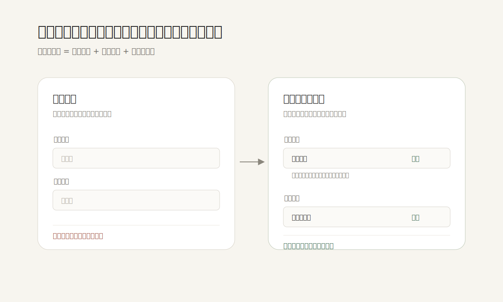

默认值不是界面偷懒，也不是替用户做决定。好的默认值是在用户还没有形成明确意图时，先给出一个安全、常见、可解释、可修改的起点；它把“我该怎么选”的压力，转化成“这个起点是否适合我”的判断。

NN/g 关于默认值的研究提醒过一个很朴素的现象：人会强烈偏向第一个、预设的、已经被系统摆好的选项。搜索结果里排在前面的条目，即使顺序被调换，仍然会获得不成比例的点击。这说明默认值不是中性的版面细节，而是一种行为引导。

所以默认值最需要克制。它不应该把商业目标伪装成“推荐”，也不应该把高风险选择静默打开。更好的做法是：默认选择低风险、常见、可恢复的路径；在旁边说明为什么这样预设；同时把“更改”放在看得见、够近、不会打断流程的位置。

例如设置页里的开关，Material Design 强调它适合独立的二元选项，并且切换后应立即生效。这类控件一旦带有默认状态，就必须让用户看懂三件事：现在是什么状态，它控制什么，改变之后会发生什么。否则默认值会从帮助变成操纵。

在表单和产品 onboarding 里，空白并不总是尊重用户。有时全空状态只是把产品内部复杂度推给用户。真正尊重用户的界面，会替用户完成那些低价值、可预测、可回退的第一步，把注意力留给真正需要判断的地方。

**追问：** 当前界面里有哪些“请选择”其实可以被一个安全、可解释、可修改的默认值替代？

> [!quote] 参考资料
> - [Nielsen Norman Group: The Power of Defaults](https://www.nngroup.com/articles/the-power-of-defaults/)
> - [Material Design 3: Switch guidelines](https://m3.material.io/components/switch/guidelines)
