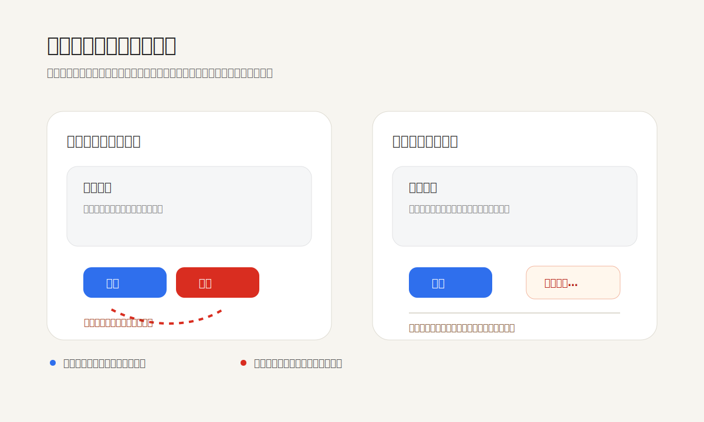

危险操作不能只靠红色来表达。真正可靠的设计，是让危险动作离开用户的惯性路径：位置更远、节奏更慢、后果更清楚，必要时还要给出确认、撤销或替代方案。

很多界面把“保存”和“删除”并排放在同一排，只是把删除按钮涂成红色。这看似醒目，实际仍然把两种性质完全不同的动作放进同一条肌肉记忆里。人在连续操作、疲劳、赶时间或使用触屏时，误触往往不是因为没看见红色，而是因为动作路径太顺了。

更好的做法不是把危险按钮做得更吓人，而是把它从主流程里“降速”。常规动作应该靠近内容、容易完成；不可逆或高代价动作则应该进入独立区域，使用明确动词，必要时加省略号、确认页、二次输入或延迟撤销。这样做的重点不是增加摩擦，而是把摩擦放在真正需要判断的地方。

Apple 的界面指南强调破坏性动作需要被清楚标识，Material Design 的对话框规范也会把确认、取消和破坏性决策放在明确的上下文中。它们背后的共同原则是：颜色只是信号之一，不能替代结构。结构要先告诉用户“这不是普通下一步”。

这个原则也适用于作品集和后台工具。删除项目、覆盖版本、永久发布、转移所有权、清空数据、取消订阅，这些动作都不应该躲在和普通按钮相同的节奏里。越是低频、高风险、难恢复的操作，越需要从视觉路径、交互节奏和文案后果上被单独设计。

**追问：** 当前界面里有没有一个高风险动作，只是被涂成红色，却仍然放在用户最顺手、最容易误触的位置？

> [!quote] 参考资料
> - [Apple Human Interface Guidelines: Buttons](https://developer.apple.com/design/human-interface-guidelines/buttons)
> - [Material Design 3: Dialogs guidelines](https://m3.material.io/components/dialogs/guidelines)
> - [Nielsen Norman Group: Error Prevention](https://www.nngroup.com/articles/error-prevention/)
> - [W3C WCAG 2.2 Understanding SC 3.3.4: Error Prevention](https://www.w3.org/WAI/WCAG22/Understanding/error-prevention-legal-financial-data.html)
