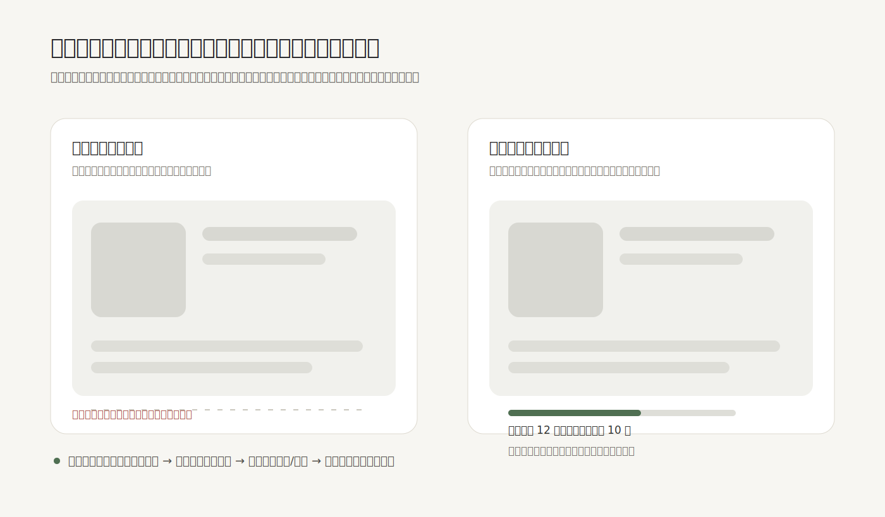

骨架屏的价值不是“让页面看起来不空”，而是让等待期间的结构仍然可理解。它一旦被当成万能加载动效，就会变成一种假进度：界面在闪，用户却不知道系统到底在取什么、要等多久、能不能离开。

常见误区是把整页内容都做成灰色块，甚至在接口超时、网络失败、权限不足时继续闪烁。这样的问题不在视觉风格，而在反馈语义：骨架屏只回答“这里将来会有什么形状”，没有回答“现在发生了什么”。如果等待超过短暂瞬间，界面就需要从占位转向状态说明，例如“正在载入最近 12 条记录”“网络较慢，可先返回列表”“载入失败，保留已填写内容并重试”。

更可靠的做法是把加载拆成几种不同关系：短等待用轻量占位保护布局；可估算流程用进度条说明范围；不可估算但可能较久的任务，用状态文案说明当前阶段和退路；失败时立刻停止假装加载，给出原因、恢复路径和已保留的信息。

骨架屏也要克制。它适合内容卡片、列表、详情页这类结构稳定的区域，不适合替代表单校验、支付确认、文件上传这类高风险过程。越接近关键决策，越不能只给用户一片安静的灰色。

**追问：** 当前界面里的加载状态，是在说明真实进展，还是只是在用动效遮住不确定性？

> [!quote] 参考资料
> - [Material Design 3：Progress indicators](https://m3.material.io/components/progress-indicators/overview)
> - [Carbon Design System：Loading](https://carbondesignsystem.com/components/loading/usage/)
> - [Nielsen Norman Group：Response Time Limits](https://www.nngroup.com/articles/response-times-3-important-limits/)
