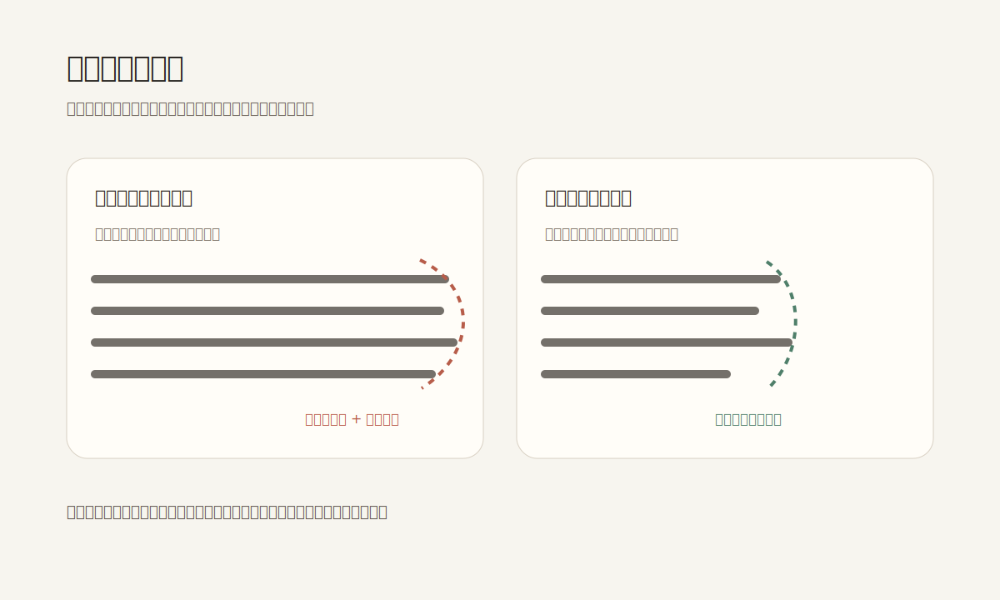

正文排版的高级感，很多时候不是来自字体本身，而是来自行宽对阅读路径的保护。屏幕越宽，越不能让文字自动铺满；一行太长时，眼睛需要做更远的横向扫视，回到下一行时也更容易丢失位置。

WCAG 2.2 的“视觉呈现”说明里，把文本块宽度、行距、段距、是否两端对齐，都放在同一个可读性问题里看。它提到一种可调机制应能让文本宽度不超过 80 个字符或字形，CJK 文本约为 40；这不是说所有界面都要机械套数字，而是提醒设计：阅读不是把字放上去，阅读需要可追踪的路径。

这也是很多产品页面、设置说明、帮助文档容易变“廉价”的地方：字号、颜色都不差，但正文容器太宽，段落像一块横向摊开的布。用户不是在阅读，而是在不断找下一行。相反，把正文收在一个有节奏的宽度里，再配合足够行距和段距，界面会自然安静下来，信息也更像被整理过。

需要注意的是，窄并不等于好。过窄会让文本频繁换行，尤其是中英文混排、代码、长数字、表单说明，会制造碎裂感。更稳的做法是：正文有最大宽度，说明文字比主任务区更收敛，列表和表单则根据扫描效率保留必要宽度。也就是说，行宽不是审美装饰，而是阅读任务的基础设施。

**追问：** 一个页面如果把所有正文宽度减半，哪些内容会变得更容易读，哪些内容反而会变得更难操作？

> [!quote] 参考资料
> - [W3C WAI: Understanding SC 1.4.8 Visual Presentation](https://www.w3.org/WAI/WCAG22/Understanding/visual-presentation.html)
> - [Carbon Design System: Typography](https://carbondesignsystem.com/elements/typography/overview/)
