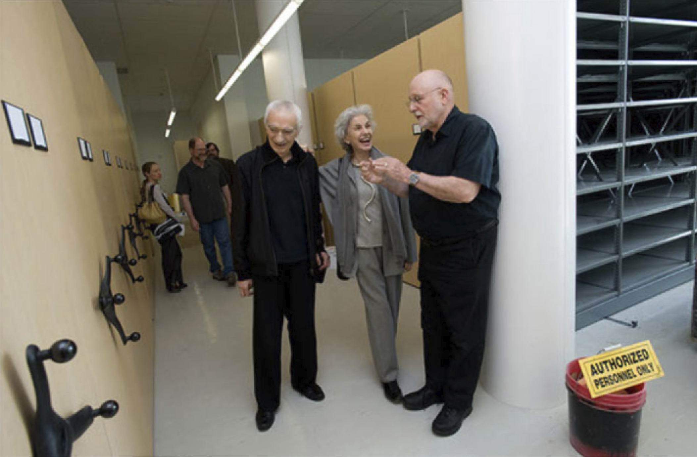

克制不是“少用元素”，而是把选择变成一套可长期执行的规则。Massimo Vignelli 的价值不在于某一种冷静外观，而在于他把字体、网格、尺度、留白和识别系统都压回同一个问题：这件事能不能被不同人、在不同媒介里稳定地继续使用？

这类设计看起来安静，是因为很多局部选择已经被提前约束了。少量字体、清楚的网格、稳定的对齐关系，不是为了显得高级，而是为了减少每一次新增页面、海报、导视、表格时的重新发明。真正的秩序感来自“下一张也能成立”，而不是这一张刚好好看。

迁移到界面设计里，这一点很实用。一个产品如果每个页面都重新设计按钮、标题、卡片和间距，用户会不断重新学习关系；设计团队也会把时间耗在局部审美争论上。更好的做法是先确定少数可复用的关系：主要信息如何占位，次要信息如何退后，动作和内容保持多近，危险操作用什么节奏脱离惯性路径。

也要避免把 Vignelli 式克制误读成“所有东西都用 Helvetica、黑白灰、居中排版”。表面风格很容易复制，难的是背后的纪律：每减少一个元素，都要让结构更清楚；每固定一条规则，都要让后续工作更自由。

**追问：** 如果一个界面今天只能保留三条视觉规则，哪三条最能帮助团队在未来十个页面里做出一致判断？

> [!quote] 参考资料
> - [Vignelli Center for Design Studies, RIT](https://www.rit.edu/vignellicenter/)
> - [The Vignelli Canon](https://www.rit.edu/vignellicenter/sites/rit.edu.vignellicenter/files/documents/The%20Vignelli%20Canon.pdf)
> - [Massimo Vignelli — Cooper Hewitt Collection](https://collection.cooperhewitt.org/people/18041679/)
