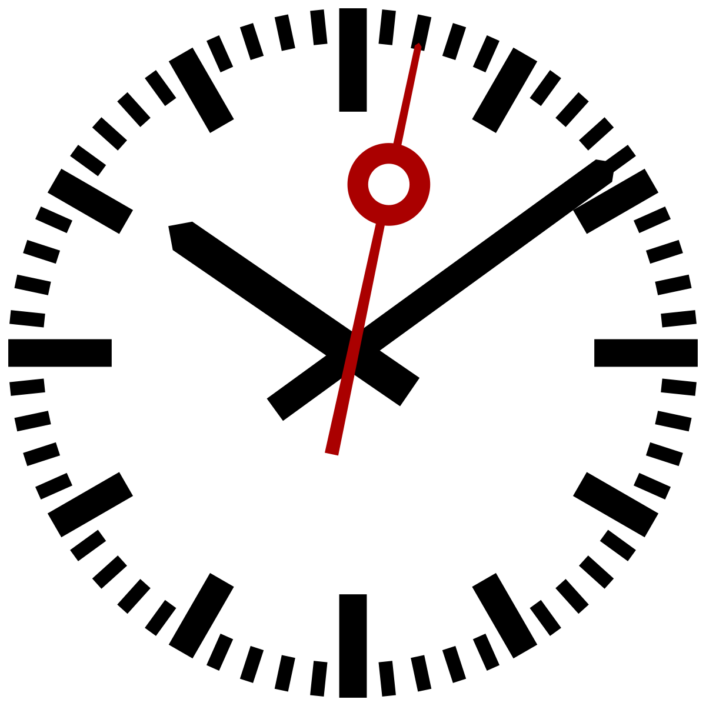

真正可靠的时间界面，不一定要表现得“连续不断”。瑞士铁路钟最值得看的细节，反而是秒针在每一分钟末端的短暂停顿：它用一个可感知的停顿，告诉人们“全站时间正在重新对齐”。

这个钟由 Hans Hilfiker 在 1944 年为瑞士联邦铁路设计。它的秒针不是机械地每 60 秒匀速绕完一圈，而是大约 58.5 秒走到 12 点位置，然后等候主时钟发出的下一分钟脉冲。表面看，这是一个“不顺滑”的动作；在车站语境里，它却把不可见的同步系统翻译成了可见节奏。

这个案例的重点不只是红色圆头秒针很醒目，也不是表盘足够极简。它真正可迁移的地方，是把系统状态做成一种人能读懂的时间行为：走动表示时间正在推进，停顿表示正在等待统一信号，重新出发表示新一分钟已经被确认。

很多数字产品容易把“实时”误解成永远滚动、永远刷新、永远播放动画。可是在涉及提交、支付、同步、部署、导入、排队这些场景时，用户需要的并不只是动起来，而是知道系统处在什么阶段、是否还可信、下一步会不会发生。适当的停顿、明确的阶段切换、稳定的完成瞬间，往往比连续动效更能建立信任。

好的等待设计不是假装没有等待，而是让等待有结构。停顿如果没有解释，会像卡住；停顿如果被放在正确的位置，就会变成校准。

**追问：**界面里有哪些地方正在用“持续动效”掩盖状态不清？能不能改成更明确的阶段、停顿和确认瞬间？

> [!quote] 参考资料
> - [Swiss railway clock - Wikipedia](https://en.wikipedia.org/wiki/Swiss_railway_clock)
> - [File:Swiss railway clock.svg - Wikimedia Commons](https://commons.wikimedia.org/wiki/File:Swiss_railway_clock.svg)
> - [MOBATIME: Railways & Metros](https://www.mobatime.com/industries/rail/)
