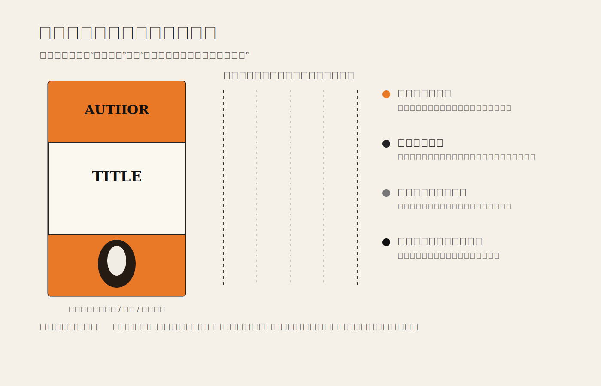

## 一句话结论

Penguin 早期平装书最值得学习的地方，不只是那条橙色横带或企鹅标志，而是它把“每一本书怎么被看见、被归类、被信任”做成了一套可以持续生产的出版秩序。

这类设计的高级感不来自单张封面的惊艳，而来自书架尺度上的稳定：读者远远看到颜色和版式，就知道这是一类可靠、便宜、可进入的知识商品；走近以后，作者、书名、出版社的关系又被清楚地摆好。它把商业、编辑、印刷、阅读和识别放进同一个系统里。

## 研究对象

1935 年，Allen Lane 创办 Penguin Books，核心判断很朴素：好书不应该只属于昂贵精装和少数书店。Penguin 官方历史里提到，他在 Exeter St Davids 火车站书摊看到书价高、品质差，于是意识到需要“everyone could afford”的好书；一年内，Penguin Books 成立，并推动了平装书革命。

这个商业判断如果没有视觉系统，很容易只变成“便宜书”。Penguin 的早期封面用了强识别的三段式结构：上方作者、中间书名、下方品牌印记；不同类别用不同颜色编码，橙色常用于小说，绿色常用于犯罪小说，蓝色用于传记等。封面少图像、少装饰，但不是贫乏，而是让读者先识别类别和可信度，再进入具体书名。

二战后，Jan Tschichold 加入 Penguin，进一步整理排版、间距、标点、字体和构图规则。重要的不是他把每本书变得“更像现代主义”，而是他把大量封面和内文排版从经验判断拉回可执行规范：什么地方该对齐，标题如何分行，留白如何保持，系列之间怎样既统一又允许差异。

## 视觉语言：少量元素，重复成制度

Penguin 封面的秩序可以拆成四层。

第一层是**货架识别**。颜色不是装饰色，而是远距离的信息编码。它先回答“这是什么类别”，再让读者决定要不要靠近。很多界面也需要这样的远距离信号：导航里的当前栏目、状态标签里的风险等级、设置页里的分组，都应该先帮助定位，而不是先展示风格。

第二层是**版式协议**。作者、标题、品牌被放在稳定位置，读者不用每本书重新学习一次阅读路径。稳定协议并不削弱内容，反而保护内容：当外部结构不制造噪音，书名和作者才更容易被看见。

第三层是**品牌的低声量**。企鹅标志很有记忆点，但它没有压过书本身。它像一个保证书：这里有一套编辑与出版标准。好的品牌系统不是每次都大声露出 logo，而是在重复使用中建立可信的秩序感。

第四层是**生产可维护性**。这点经常被忽略。一个视觉系统如果只能由少数设计师凭感觉完成，它就很难服务大量内容。Penguin 的价值在于，它让编辑、排版、印刷和销售都能围绕同一套规则工作。设计在这里不是单件作品，而是组织能力。

## 为什么这不是“模板化”

模板化的问题，是所有内容被压成同一种表情；系统化的价值，是让不同内容共享稳定语法，同时保留必要差异。

Penguin 的封面并不是说“所有书都应该长一样”，而是说：在大众出版这个场景里，读者最先需要的是价格可亲、类别清楚、品质可信、购买低风险。三段式封面和颜色编码，正好把这些需求翻译成了视觉秩序。

这也是它和很多“复古风封面模仿”的区别。只复制橙色横带、居中标题和企鹅图案，很容易变成怀旧装饰；真正可迁移的是背后的判断：在大量内容并列出现的环境里，先建立可学习的关系，再允许单个内容表达个性。

## 迁移到 UI/UX

界面设计里也有类似的“书架问题”：大量卡片、大量设置项、大量文档、大量通知、大量状态同时出现。问题不只是某一张卡片是否好看，而是用户能不能在重复结构中快速判断：我在哪里、这是什么类别、哪个更重要、下一步能做什么、风险在哪里。

可迁移的做法有三条。

第一，给同类对象稳定位置。列表里的标题、状态、时间、主动作不要每个模块都重新摆。稳定位置会降低扫描成本。

第二，用颜色承担分类或状态，不要只承担气氛。颜色一旦被赋予意义，就要克制使用；否则它会从信息编码退化成装饰噪音。

第三，把设计规则写到组件和内容规范里。真正的系统不是 Figma 里一套漂亮组件，而是让后来的人也能判断：什么时候用这个样式，什么时候不能用，例外如何处理。

## 常见误区

第一个误区，是把系统设计理解成“统一外观”。统一只是表面结果，真正重要的是统一关系：同类信息以同样方式出现，不同风险以不同成本出现，主要路径始终比次要路径更容易被看见。

第二个误区，是为了追求品牌感，让每个页面都过度表达。Penguin 的启发恰好相反：品牌感可以很安静，只要它在长期重复中持续兑现承诺。

第三个误区，是先做视觉模板，再回头塞内容。好的系统应该从内容生产和使用场景出发：内容有多少种？读者如何扫描？哪些信息先出现？哪些差异必须保留？哪些差异应该被消除？

## 可沉淀原则

当设计对象会大量重复出现时，不要先问“这一件怎么更漂亮”，要先问“这一类对象如何被稳定识别”。

单件作品追求瞬间吸引，系统设计追求长期信任。封面、卡片、列表、导航、通知、表单，本质上都在回答同一个问题：用户是否能在重复中减少判断成本，在差异中找到真正有意义的信息。

**追问：** 现在的界面或作品集中，有没有某一类内容每次都在重新发明版式？如果把它当作“书架上的一套系列”来设计，哪些位置、颜色、命名和状态应该被固定下来？

## 参考资料

- [Penguin Books UK：Company history](https://www.penguin.co.uk/about/company-history)
- [Wikipedia：Jan Tschichold](https://en.wikipedia.org/wiki/Jan_Tschichold)
- [Wikipedia：Penguin Books](https://en.wikipedia.org/wiki/Penguin_Books)
- [AIGA Design Archives / Medalist reference：Jan Tschichold](https://www.aiga.org/medalist-jan-tschichold)
