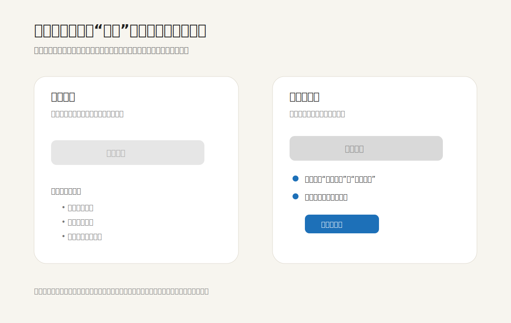

禁用状态最容易被误解成一种视觉样式：按钮变灰，事情就结束了。但在真实任务里，“不可点击”不是答案，它只是一个新的问题：为什么不能点？还差什么？能不能自己修好？什么时候会恢复？

一个沉默的灰色按钮会把判断压力交还给用户。用户可能以为系统坏了、权限不够、网络失败，或者表单还有隐藏错误。界面看起来很克制，体验却变得含糊。真正安静的做法不是减少说明，而是把说明放在最接近行动的位置，让人不用离开当前任务就能理解条件。

比较好的结构通常包含三件事：第一，按钮可以保持不可用，以防止误提交；第二，按钮附近要说明不可用的具体原因，而不是只给一个泛泛的“请完善信息”；第三，如果原因可修复，就给出明确路径，例如“还需填写联系电话”“完成上传后可提交”“当前账号无审批权限，请联系管理员”。

这里的关键不是每个禁用按钮旁边都塞满解释。低风险、瞬时、显而易见的状态可以很轻；但只要用户已经投入填写、上传、配置、结算这类成本，禁用状态就不应该沉默。它需要像一块小路标：不抢占画面，但清楚说明下一步在哪里。

常见误区是把“界面干净”理解为“把条件藏起来”。这会让灰色按钮变成一种冷淡的拒绝。更好的克制，是让不可用状态承担信息秩序：减少错误点击，同时减少猜测。

**追问：** 当前界面里有没有某个灰色按钮，只告诉人“不能做”，却没有告诉人“怎样才能做”？

> [!quote] 参考资料
> - [GOV.UK Design System: Button](https://design-system.service.gov.uk/components/button/)
> - [WAI-ARIA Authoring Practices: Focusability of disabled controls](https://www.w3.org/WAI/ARIA/apg/practices/keyboard-interface/#kbd_disabled_controls)
> - [Material Design 3: Buttons](https://m3.material.io/components/buttons/guidelines)
