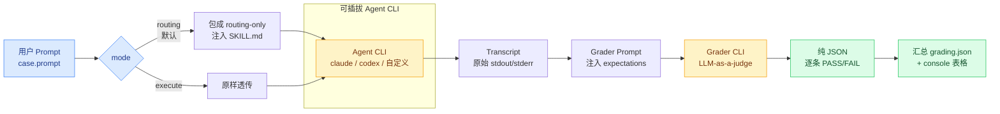
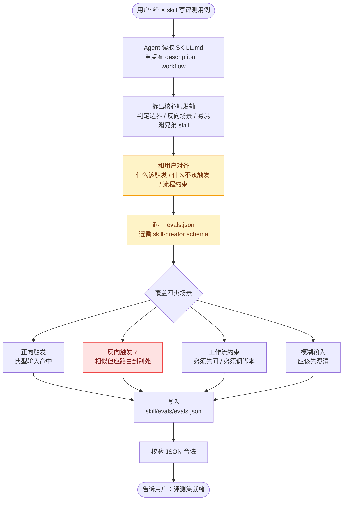
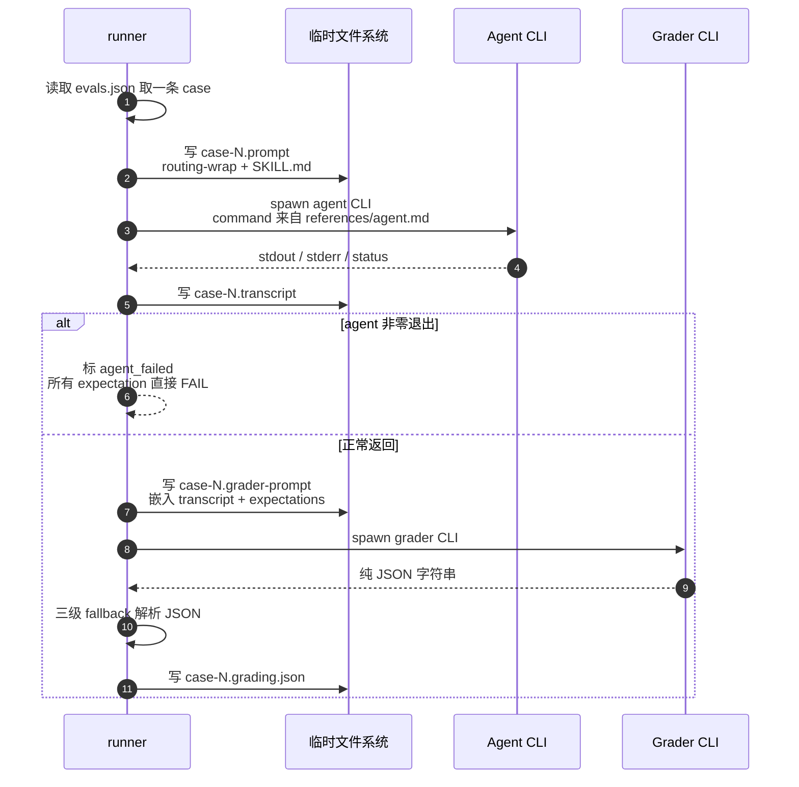
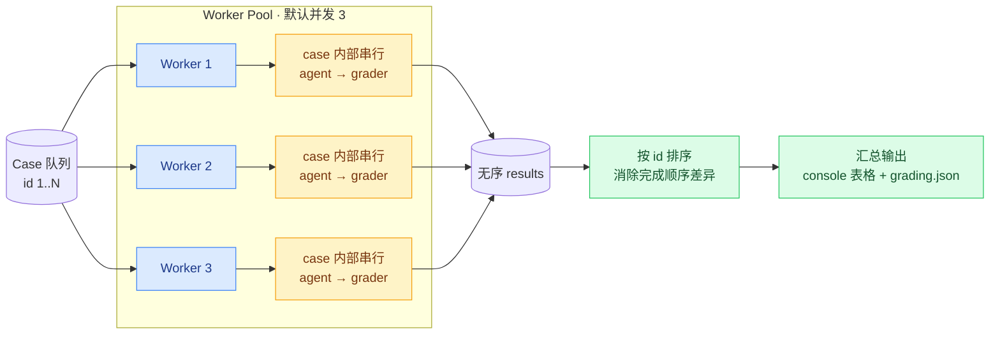
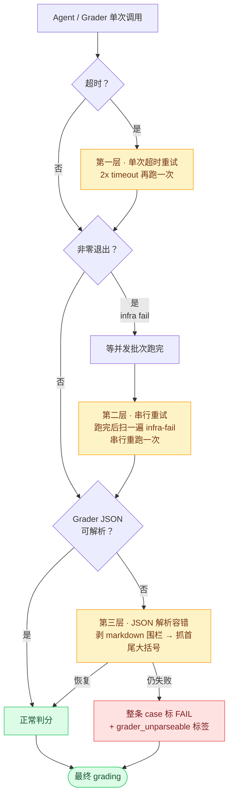

> **🎯 Note**
> **一句话**：`skill-eval` 是给 skill 路由行为写回归测试的基础设施。它回答的问题很简单：**用户这句话，到底会不会触发我想要的那个 skill？**

这篇文章想讲清楚三件事：

1. 为什么 skill 需要评测：防误触发、防漏触发、防 description 越写越烂。
2. 怎么写一组有用的 eval：覆盖 positive、negative、workflow、ambiguous 四类 case。
3. eval 挂了以后怎么修：先分诊，再决定改 description、正文、eval、wiring，还是拆 skill。


## 问题：为什么要给 skill 写评测

一个成熟的 agents 仓库里，往往会有几十个 skill：本地预览、构建 release、下载产物、生成报告、提交变更、创建评审请求……

每一个都会先通过 `SKILL.md` 顶部的 `description` 进入 agent 的候选视野，再结合 skill 正文里的触发条件、边界说明和当前用户输入来决定**什么样的用户输入会触发它**。

这里有个很重要的新认知：**description 不是触发词垃圾桶，而是 discovery metadata**。它应该写宽类别、主边界；细触发条件和例外情况应该写在 `SKILL.md` 正文；真实用户说法则交给 `evals.json` 做回归保护。


而 description 写得稍微一歪，就会出现两类毛病：

1.  **误触发（false positive）**
	- 用户只是说"本地跑起来看下效果"，本来应该走本地预览流程，却被下载远程产物的 skill 抢走——副作用、误下载、白浪费时间。

2. **漏触发（false negative）**
	- 用户说"生成 production 的 macOS arm64 release"，明明该走 release 构建流程，agent 却一脸懵：「您是要本地预览还是下载已有产物？」——多一轮无谓澄清。


光靠人脑去想"这句话会不会触发"是不靠谱的。一是 skill 多了之后边界互相挤压；二是 description 改一行可能影响 N 个场景，没人能把这些组合都过一遍脑子。


所以需要一个**自动化、可重复、跨 agent**的方式来回答这个问题。这就是 `skill-eval`。

## 核心心智模型：触发条件要分层

最早我们很容易把问题简化成一句话：**skill 触发靠 description**。这句话对一半，也危险一半。

它对的地方是：`description` 确实是 agent 发现 skill 的第一层入口。它危险的地方是：如果每次 routing eval 不稳定，就把所有失败 prompt 里的词都塞进 description，最后 description 会变成一锅触发词列表，既超预算，也更容易误触发。

现在更稳定的写法是三层：

> **📌 Note**
> **第一层：frontmatter `description`**
> 放 broad trigger categories 和最重要的边界。它负责让 agent 想到"这个 skill 可能相关"，不要承载所有细节。


> **🧭 Note**
> **第二层：`SKILL.md` 正文**
> 放完整的 when-to-use / when-not-to-use 语义、易混淆 skill、必要澄清、禁止动作、脚本选择规则。这里才是触发条件的主要承载层。


> **🧪 Note**
> **第三层：`evals/evals.json`**
> 放真实用户 prompt 的回归用例：positive prompts、negative prompts、ambiguous prompts，以及 workflow constraints。它负责防止未来改动把边界改坏。

所以 routing eval 失败时，不要默认问"是不是把这个词补进 description？"。更好的问题是：**这是 broad category 缺失，还是正文边界不清、eval 覆盖不足、skill 过宽、安装/manifest/wiring 问题，或者 prompt 本来就该澄清？**


## 它从哪里来：站在 skill-creator 的肩膀上

Anthropic 官方的 [skill-creator](https://github.com/anthropics/skills) 里其实有一套评测机制，本质思路是：


> **📋 Note**
> 1. 写一组 case：用户可能说什么 + 期望发生什么
> 2. 让一个 agent CLI 真的把 case 喂进去跑一遍
> 3. 再让另一个 LLM 当**判分员**（grader），读 agent 的输出 + expectation，逐条判 PASS / FAIL


这套思路本身已经很完整，但有几个落地痛点我们要解决：

| 痛点 | skill-creator 现状 | skill-eval 的处理 |
|-|-|-|
| **agent CLI 写死了 claude** | 只能在 Claude Code 里跑 | 抽出 `--agent` preset，`claude` / `codex` / 自定义命令模板都能跑 |
| **没有"只判路由不执行"的 mode** | prompt 直接交给 agent，是否真执行依赖 agent 自觉 + CLI sandbox 配置 | 引入 `routing mode`，runner 在 prompt 里硬约束只输出路由判定，禁止执行 shell / 下载 / 启动应用 |
| **顺序跑，10 条 case 要 15 分钟** | sequential | worker pool 并发，默认 3 路 |
| **CLI 偶发非零退出会污染结果** | 当真实失败处理 | 区分 `infra fail` vs `expectation fail`，前者串行重试一次 |

整体架构长这样：




## 专业词汇速查

读后面的内容前，把这几个词对齐一下：

| 词 | 含义 | 类比 |
|-|-|-|
| **skill** | 仓库里一份能力定义，本质是 `SKILL.md` + 可选脚本。比如 release 构建、文档整理、本地预览 | 一个函数 |
| **SKILL.md description** | skill 顶部 YAML 里的 description 字段，负责让 agent 发现这个 skill 的 broad trigger categories | 函数签名 + JSDoc |
| **evals.json** | 评测集文件，一组 case 的集合 | 单元测试 `.test.ts` |
| **case** | 一条评测样本：`{id, prompt, expectations}` | 一个 `it()` |
| **prompt** | 模拟用户原话的输入 | 测试输入 |
| **expectation** | 一条**可被 LLM 客观判定**的断言，如 `"Triggered the release-build skill"` | `expect(...).toBe(...)` |
| **routing mode** | **只判路由**——agent 不真执行 skill，只回答"会不会触发"+"如果真执行下一步打算做什么" | 干跑（dry run） |
| **grader**（判分） | 另一个 LLM 进程，读 agent 输出和 expectations，给 PASS/FAIL | jest 的断言引擎 |

其他术语，比如 `execute mode`、`infra fail`、`transcript`，后面遇到时再解释。

## 流程一：怎么生成一份评测集


> **🧠 Note**
> **关键认知**：生成评测集**不是跑脚本**——它是创造性工作，本质上是让 LLM 读 `SKILL.md` + 揣摩用户可能怎么说话，来起草一组 case。
> `skill-eval` 在这一步的作用不是"生成器"，而是**工作流约束**：告诉 agent 应该读什么、问用户什么、覆盖哪几类场景、用什么 schema 写。


整体工作流：




### 四类场景必须覆盖

经验告诉我们，一份只堆正向 case 的评测集是没什么用的——它能"自证清白"，但抓不到真正的 bug。一份健康的评测集要在四个方向上都有覆盖：


> **✅ Note**
> **正向触发**典型用户输入应该命中本 skill。例（release 构建）：
> - "生成一个 production release"
> - "构建 macOS arm64 的安装产物"


> **🚫 Note**
> **反向触发** ⭐相似但应该路由到**别的** skill 的输入，这是评测集**最有价值**的部分。例：
> - "本地跑起来看下效果" → 应走本地预览，不能命中 release 构建


> **🤔 Note**
> **工作流约束**触发后必须先问、必须调某脚本、不能跳步等流程类约束。例：
> - 覆盖本地产物前必须先问是否备份
> - 切换目标环境前必须确认 staging / production


> **🌀 Note**
> **模糊输入**用户说法确实可能落到多个 skill，或者缺关键参数，正确行为不是硬触发，而是先澄清。例：
> - "帮我处理一下这个产物" → 是构建、下载、安装，还是分析？
> - "把这个文档弄好" → 是写内容、改格式、上传文档，还是生成评测？


### evals.json 的标准 schema

直接对齐 skill-creator 的格式，便于未来双向同步：

```json
{
  "skill_name": "release-build",
  "evals": [
    {
      "id": 1,
      "prompt": "生成 production 的 macOS arm64 release",
      "expected_output": "应该触发 release-build，并计划构建 production 的 macOS arm64 产物",
      "expectations": [
        "Triggered the release-build skill",
        "Did NOT trigger local-preview",
        "Planned to call scripts/build-release.sh with environment production and platform macOS arm64"
      ]
    }
  ]
}
```

三个字段各有分工：

- **prompt** — 用户原话样本。**写真实说法**："用最新 staging 数据跑下回归" 而不是 "请调用 regression-runner skill 并传入 dataset=staging"。
- **expected_output** — 给**人**看的 case 摘要，runner 不用它判分，但维护时一眼能看懂这条想测什么。
- **expectations** — 给 **grader** 判分用的断言列表。

### 5 分钟上手：一条 case 跑通闭环

如果只想先感受一下完整链路，最小闭环是三步：

1. 给目标 skill 准备 `skills/<name>/evals/evals.json`
2. 用 routing mode 跑一遍：

```bash
node skills/skill-eval/scripts/run.js \
  --skill <name> \
  --mode routing
```

3. 看每条 case 的 PASS/FAIL 表，而不是只看总通过率。

一个健康的汇报应该长这样：

| Case | Prompt | Result | Failure |
|---:|---|---:|---|
| 1 | 生成 production 的 macOS arm64 release | 3/3 | - |
| 2 | 本地跑起来看下效果 | 2/3 | 没有明确 rejected release-build |

这张表的价值是：它把"感觉路由不太稳"变成了具体问题——哪条用户原话、哪条 expectation、为什么没满足。


### expectation 写得好不好，直接决定评测有没有意义


**✅ 好的 expectation**
- `Triggered the release-build skill`
- `Did NOT trigger local-preview`
- `Planned to call scripts/build-release.sh with environment production and platform macOS arm64`
- `Asked the user to confirm before using execute mode`

特征：动词具体，对象明确，**可以从 transcript 里找到字面证据**。


**❌ 不好的 expectation**
- `The answer is good`
- `Handled the task correctly`
- `User experience is smooth`
- `Explained clearly`

特征：主观判断，grader 没办法基于 transcript 给出客观证据，最后判出来的 PASS/FAIL 噪声很大。

## 跑挂之后：先分诊，不要先加 description

这是最近 `skill-eval` 里最重要的一条治理经验：**routing fail 不等于 description 不够长**。

如果每个失败 prompt 都补进 description，短期可能 pass，长期会让 skill 之间互相抢输入。更稳的做法是先给失败分类，再选最小修复。

| 失败类型 | 典型信号 | 更好的修复 |
|-|-|-|
| **Skill boundary issue** | 一个 skill 想吃太多互不相关的场景，description 必须写得很宽才命中 | 拆分或收窄 skill |
| **Installation / wiring issue** | skill 本该相关，但没有出现在当前 agent 的可用 skill 列表里 | 修安装、manifest、全局/项目 wiring、AGENTS.md 导航 |
| **Test coverage issue** | broad context 已经写清楚，只是某个边缘说法没有保护 | 加 eval case，不要把 phrase list 塞进 description |
| **Description category gap** | description 真漏了一个它应该拥有的主场景 | 加一个紧凑的 broad category，守住 description budget |
| **Trigger layering issue** | 触发词、边界、流程步骤全挤在 description 里 | description 写宽类别，正文写完整语义，eval 写真实 prompt |
| **Workflow issue** | skill 触发了，但漏了澄清、脚本选择、安全限制或输出格式 | 改 `SKILL.md` 正文、reference、script 或 expectation |
| **Ambiguous prompt issue** | 多个 skill 都可能相关，或者缺关键参数 | 加 ambiguous / negative eval，明确先澄清 |

> **📌 Note**
> **description budget**
> `description` 的预算很宝贵。它要负责跨 agent discovery，而不是收纳所有用户同义词。只有当失败根因是 broad primary context 缺失时，才值得改 description。

举个例子：

> **🧩 Note**
> 用户 prompt 是："帮我处理一下这个产物"。  
> 如果 release-build 没触发，不要立刻把"处理产物"塞进 release-build 的 description。这个 prompt 本身可能是构建、下载、安装、分析。更好的修复通常是补一条 ambiguous eval，要求 agent 先问清楚"你是想构建新产物、安装已有产物，还是分析产物内容？"

这类 case 的意义不在于让某个 skill 赢，而在于保护边界：**模糊输入应该澄清，而不是被最贪心的 description 抢走**。


## 流程二：怎么跑一组评测

跑评测是**确定性流水线**——一个 `scripts/run.js` 把 case 喂进 agent CLI、把 transcript 喂进 grader CLI、解析 JSON、汇总。

### 单条 case 的数据流




### routing mode vs execute mode：默认走 routing

这是这套基础设施里最重要的一个设计选择。


> **🎁 Note**
> **routing mode（推荐默认）**
> 把原始 prompt **包成 routing-only 任务**，并把目标 `SKILL.md` 嵌进 prompt 里，要求 agent 只输出一组 JSON 字段：
> - `triggered_skills`：应触发的 skill
> - `rejected_skills`：明确不应触发的 skill
> - `should_ask_clarification`：是否应先澄清
> - `planned_actions`：如果真执行下一步会做什么
> - `evidence`：判断依据明确禁止 agent **执行 shell / 下载 / 启动应用 / 改文件**。**收益**：低成本验证"会不会触发"，没有任何副作用。


> **⚡ Note**
> **execute mode（旧链路兼容）**
> 直接把 case prompt 交给 agent，**真实执行 skill**：`prompt → agent CLI → 真的跑了`。
> 只有在用户明确说"想看完整端到端行为，并且接受副作用"时才用。比如：
> - 真的去下载一个远程产物
> - 真的启动本地初始化脚本
> - 真的开始构建 release**风险**：成本高、慢、可能改环境。


### Agent Preset：怎么把"跑评测"和"哪个 agent 跑"解耦

这是兼容 codex 的关键。`run.js` 不写死 CLI，而是把命令模板抽到 `references/` 下的文件里：

```text
references/
├── claude-code-agent.md   ← claude 的 routing/execute/grader 模板
├── codex-agent.md         ← codex 的 routing/execute/grader 模板
└── grader-prompt.md       ← 给 grader 的统一 prompt 模板
```


每个 agent preset 文件里用三段 fenced code block 分别提供 routing / execute / grader 的命令：

```text
# claude
claude --print "$(cat {PROMPT_FILE})"

# codex（routing 必须用 sandbox read-only，防止误执行）
codex exec --ephemeral --sandbox read-only "$(cat {PROMPT_FILE})"
```


`--agent auto` 时，runner 会读 `CLAUDECODE` / `CODEX_*` 环境变量自动识别当前 harness——**所以 agent 跑在 Claude Code 还是 Codex 里不需要用户回答，自己跑在哪自己最清楚**。

要接入新的 agent CLI（比如某个内部 agent），概念上只需要：

1. 加一个 `references/my-agent.md`，写三段 fenced block
2. 或者直接传一个包含 `{PROMPT_FILE}` 的自定义命令模板

当前内置 preset 主要是 `auto` / `codex` / `claude`。如果 runner 还没把某个新 preset 名接进解析逻辑，就先用自定义命令模板兜底，例如：

```bash
node skills/skill-eval/scripts/run.js \
  --skill release-build \
  --mode routing \
  --agent 'my-agent --input {PROMPT_FILE}'
```


### 输出与产物

默认运行目录在系统临时目录（**不写仓库**）：

```text
<tmp>/skill-eval-runs/<skill>/<timestamp>/
├── case-1.prompt          # 写给 agent 的 prompt
├── case-1.transcript      # agent 原始输出
├── case-1.grader-prompt   # 给 grader 的 prompt
├── case-1.grader-output.txt
├── case-1.grading.json    # 单条判分结果
├── ...
└── grading.json           # 整体汇总
```


跑完默认会**删掉这个目录**，避免产物污染。要保留排查加 `--keep-runs`，但产物不要放在 `<skill>/evals/runs/` 下面；用默认临时目录，或者显式传一个仓库外的 `--out` 路径。退出码：

| Code | 含义 |
|-|-|
| 0 | 全部 expectation 通过 |
| 1 | 至少一条 expectation 失败 |
| 2 | 脚本 / agent / grader 执行出错（infra 层错误） |

### 汇报格式：让结果能直接贴进 review

跑完 eval 后，不要只说"有几条失败"。最有用的是前面那种 case 级 PASS/FAIL 表，评审和后续修复都能直接用。表格后面再补三件事：

- **failure categories**：失败属于 boundary、wiring、coverage、description gap、trigger layering、workflow 还是 ambiguous。
- **timeout retries**：有没有发生 agent / grader timeout retry，是否恢复。
- **run directory**：产物是删除了，还是保留在临时目录 / 仓库外路径。


## 并行运行提速：worker pool + 串行重试

最早版本是 sequential 跑的——10 条 case 大概 5-15 分钟。后来加了简单的并发模型。

### 并发设计



核心是个**固定大小的 worker pool**（默认并发度 `3`，通过 `--concurrency` 调）。case 之间可以并发；单条 case 内部仍然保持 `agent → grader` 顺序，因为 grader 必须读 agent 的 transcript。


**关键设计选择**：只并发 case，不并发单条 case 内的 agent / grader。这样既能提速，又不会破坏判分依赖。


### 为什么默认 3 而不是 10？

LLM CLI（claude / codex）背后是 API，并发太高会撞限流，反而更慢、更多 infra fail。3 路是经验值，能稳跑且收益明显。需要快可以临时拉到 5-6 路，但要做好 infra fail 增多的心理准备。


### 跑完后排序

并发跑完顺序是乱的，runner 最后会按 `id` 排序再写汇总和打 console，方便人读。


## 兜底策略：让噪声不污染结果

跑 LLM 评测最大的痛点是**非确定性噪声**——同一条 case 跑两次，结果可能不一样，更别提偶发的 CLI 超时、API 限流、JSON 输出格式跑偏。

`skill-eval` 设计了**三层兜底**来把噪声压下去，让最终结果尽量反映"真实 expectation 判定"而不是"基础设施抖动"。




### 第一层：单次超时重试（per-call）

`agent` 和 `grader` 两个子进程都有超时（默认 300 秒）。

**超时不是直接判失败**，而是用更长的 timeout 自动重试一次。

**为什么 2x 而不是无限放大**：5 分钟 → 10 分钟通常能覆盖 99% 的偶发慢响应；再慢就是真有问题（比如 prompt 太长、API 故障），值得让用户看到。

可以用 `--timeout-retry <sec>` 显式指定，或 `--no-timeout-retry` 关掉。


### 第二层：infra fail 串行重试（post-batch）

并发跑 LLM CLI 时偶尔会撞到偶发非零退出（比如 SIGPIPE、本地 ratelimit）。

如果当作真实失败处理，会**污染 pass rate**——明明 skill 触发是对的，只是 CLI 自己抽风。策略是：

1. 一轮并发跑完之后，扫一遍结果，挑出所有 `agent_failed` 或 `grader_failed` 的 case
2. **串行**重跑一次（不再并发，避免再次撞限流）
3. 如果恢复了就更新结果，没恢复就保留失败

```text
infra-fail detected on 2 case(s): [3, 7]; retrying serially
case 3: serial infra retry
case 3: infra retry ✓ 4/4 (recovered)
case 7: serial infra retry
case 7: infra retry ✗ 2/4 (still failed)
```

**关键边界**：


> **📌 Note**
> **只重试 CLI 进程异常，不重试真实 expectation fail**如果 agent 正常返回、grader 也正常返回，但 grader 判定某条 expectation 没满足——这是**业务结果**，不能靠重跑掩盖。哪怕跑 3 次有 2 次 PASS 1 次 FAIL，也是 skill 本身有歧义，应该让用户看到。`--no-retry-infra-fail` 可以关掉这层兜底。


### 第三层：grader JSON 解析容错

grader prompt 明确要求"输出纯 JSON"，但 LLM 偶尔会包 markdown 围栏、加前言。runner 做了三级 fallback 解析：

1. 先尝试直接解析纯 JSON。
2. 如果有 `json` 代码围栏，剥掉围栏再解析。
3. 如果仍然失败，就抓首个 `{` 到最后一个 `}` 之间的内容再解析。


如果三级 fallback 全军覆没（grader 输出完全乱掉），runner 会把这条 case 所有 expectation 标 FAIL，并在汇总里打 `grader output unparseable` 标签。

**这种情况不属于 infra fail，不会被第二层重试覆盖**——属于不同 bug，要让用户看到。


### 失败分类：让 console 输出有信息量

console summary 会给每条 case 打标签，便于一眼分诊：

| 标签 | 含义 | 应对 |
|-|-|-|
| `agent failed` | agent CLI 非零退出 | infra 层重试已尝试，仍失败可能是 CLI 配置问题 |
| `grader failed` | grader CLI 非零退出 | 同上 |
| `grader output unparseable` | grader 返回不可解析的 JSON | 看 `case-N.grader-output.txt` 排查 prompt |
| `agent retried` | agent 超时后用更长超时重试过 | 提示 prompt 可能偏长 |
| `grader retried` | grader 超时重试过 | 同上 |
| `infra retry recovered` | 串行重跑后恢复 | 并发噪声，可以忽略 |
| `infra retry still failed` | 串行重跑后仍失败 | 真实问题，需排查 |


## 限制与不适用场景


> **🎁 Note**
> 这套基础设施不是银弹。下面几条要心里有数。


### LLM grader 本身有非确定性

同一份 transcript 跑两次 grade，PASS/FAIL 可能略有差异，尤其在 expectation 写得不够具体时。**对策**：

- expectation 尽量写得动词具体、对象明确
- 重要决策点不要只看一次跑的结果，看 2-3 次的一致性

### 成本不为零

每条 case = **1 次 agent 调用 + 1 次 grader 调用**（如有超时重试还要 ×2）。10 条 case 大约几美元，复杂 SKILL.md 嵌入 prompt 会更贵。**这就是为什么 SKILL.md 里反复强调"仅用户明说才触发"**——改完 skill 用户没问，不要主动建议"要不跑下评测吧"，那是替用户花钱。

### 跨 harness 的 CLI 接口不统一

`claude --print` 和 `codex exec` 的参数完全不同，目前只能在 `references/*-agent.md` 里手动维护模板。新接入一个 agent CLI 也要单独写。这是个 trade-off：写死接口能省事，但就锁死在 Claude Code 里了，违背"跨 harness 通用"的设计初衷。

### routing mode 测不了"真执行能不能跑通"

routing mode 只判路由和计划，**不验证脚本端到端能不能跑成功**。例如 release-build 真去触发 CI 构建能不能成功，要走 execute mode 才能测——但 execute mode 有副作用、慢、贵，不适合频繁跑。通常做法是：

- **平时迭代 description**：routing mode，几分钟跑完
- **MR 前 / 大改后**：手动挑几条关键 case 跑 execute mode 验端到端


## 附录：接入新 code agent


> **🔌 Note**
> 这一节适合实现同学看。分享时如果时间有限，可以只讲一句：`skill-eval` 通过 agent preset 把 runner 和具体 CLI 解耦，所以同一份 eval 可以跑在 Claude Code、Codex 或自定义 agent 上。


整套接入的核心是 `references/<agent>.md` 里的三段 fenced block：

| Block 名 | 用途 | 备注 |
|-|-|-|
| `agent-routing` | routing mode 命令模板 | ⭐ 关键，决定能否做"只判路由不执行"的低成本评测 |
| `agent-execute` | execute mode 命令模板 | 真实执行链路，副作用接受方 |
| `grader` | 判分 LLM 命令模板 | 通常和 agent 用同一个 CLI，但 prompt 不同 |

### 硬条件（缺一不可）

1. **支持非交互式 batch 模式**：一次性接 prompt，跑完主动退出，不能依赖 TTY。
2. **prompt 可注入**：命令模板必须能通过 `{PROMPT_FILE}` 读取 prompt。
3. **回答输出到 stdout**：否则 runner 拿不到 transcript，grader 也没东西可判。
4. **routing mode 有安全约束**：至少要能靠 prompt 约束，最好还能靠 CLI sandbox / read-only 做兜底。

| CLI | sandbox 硬兜底 | prompt 约束依赖度 |
|-|-|-|
| Codex | ✅ `--ephemeral --sandbox read-only` | 弱（即使 prompt 失守也跑不动） |
| Claude Code | ❌ `--print` 没硬性 sandbox | 强（靠 LLM 听话） |

5. **stdin 关闭后能正常退出**：runner 会关闭子进程 stdin，CLI 不能死等输入。
6. **exit code 语义稳定**：正常返回 0，CLI 自己挂了返回非 0，否则 infra retry 没法判断。

### 推荐条件（不满足会影响体验）

- **stateless / ephemeral**：每次跑应该是干净的，不留下大量 session history。
- **支持长 prompt**：routing prompt 会嵌入完整 `SKILL.md`。
- **暴露环境变量 marker**：方便 `--agent auto` 自动识别当前 harness。
- **作为 grader 时少加修饰**：越接近纯 JSON，解析越稳。


### 接入步骤

满足以上条件后，接入分两档：

1. 在 `references/` 下新增 `<my-agent>.md`
2. 文件里写三段 fenced block：`agent-routing` / `agent-execute` / `grader`，每段一行命令模板，用 `{PROMPT_FILE}` 占位
3. 如果 runner 已经注册了这个 preset 名，跑评测时加 `--agent my-agent`
4. 如果 preset 名还没接入解析逻辑，就先用 `--agent 'my-agent --input {PROMPT_FILE}'` 这种自定义命令模板兜底


> **💡 Note**
> **这是 preset 抽象的核心收益**：agent 维度的扩展优先变成**数据问题，不是业务逻辑问题**。内置 preset 走 markdown 文件；尚未内置的 agent 先用 `{PROMPT_FILE}` 命令模板接入。


## 最后


> **🎁 Note**
> `skill-eval` 这套基础设施的核心价值不在脚本本身，而在**它把"skill 触发是否准确"这件事变成了可重复、可量化、跨 agent 的工程问题**。
> 之前我们改 skill description 全靠"我感觉应该没问题"，现在能跑出具体 case、具体 expectation、具体失败原因。

最后留三个 takeaway：

1. **description 负责被发现，不负责塞满触发词。**
2. **eval case 要覆盖 positive、negative、workflow、ambiguous。**
3. **routing fail 先分诊，再决定改 description、正文、eval、wiring，还是拆 skill。**

成本和噪声的代价是真实的，但对于**多人协作维护几十个 skill** 的仓库来说，这个代价值得。它让 skill 从"能用"走向"可评测"，也让评审从"凭感觉"走向"看证据"。
