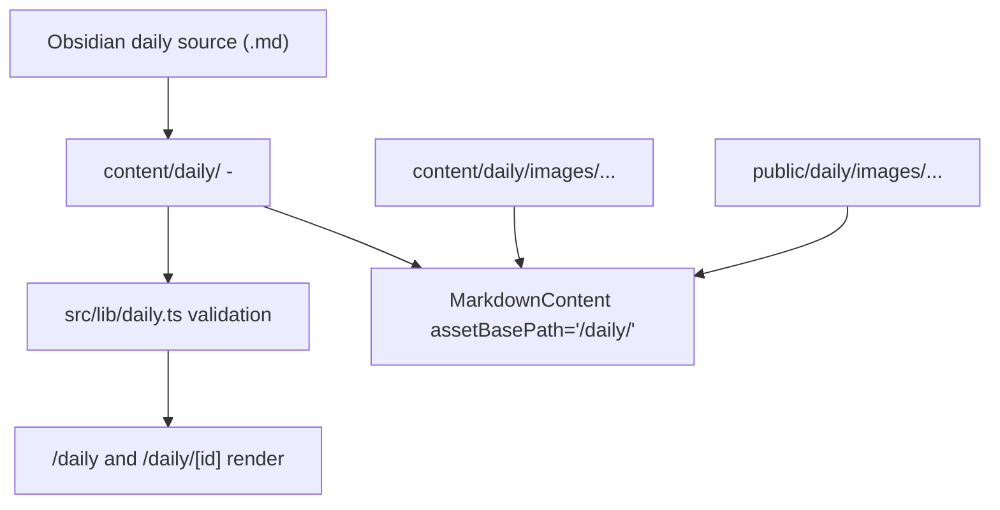

# Daily System

每日分享内容先以 Markdown 文件落到 [`content/daily`](../content/daily/)，再由 [`src/lib/daily.ts`](../src/lib/daily.ts) 在构建时做 frontmatter 校验，并通过 daily 页面渲染链路输出。

## Required Frontmatter

每篇 daily 条目都必须满足这些构建期约束：

- 文件名必须以 `YYYY-MM-DD` 开头，可用 `YYYY-MM-DD-title.md` 或 `YYYY-MM-DD - title.md`
- 必填 frontmatter：`id`、`title`、`date`、`type`
- `date` 必须是 `YYYY-MM-DD`
- `type` 只能是 `daily-share` 或 `deep-share`
- `tags` 如果存在，必须是字符串数组
- `id` 必须全局唯一，且只能使用字母、数字、`-`、`_`

这些约束由 [`src/lib/daily.ts`](../src/lib/daily.ts) 强制执行；不要依赖页面运行时兜底。

## Asset Rules

daily Markdown 可以继续使用相对资源引用，例如 `images/...`，但同步时必须同时维护两份资源：

- 内容副本放到 [`content/daily/images`](../content/daily/images)，保持与 Markdown 中的相对目录一致
- 可访问副本放到 [`public/daily/images`](../public/daily/images)，保证页面实际可加载

daily 页面渲染时会通过 [`src/components/markdown-content.tsx`](../src/components/markdown-content.tsx) 的 `assetBasePath="/daily/"` 把相对图片 URL 归一化成 `/daily/images/...`。如果未来新增图片型资源，优先沿用这套相对路径约定，不要把正文改写成机器本地绝对路径。

## Interaction Rules

- `/daily` 和 `/daily/[id]` 的 tag filter 必须保持 URL-addressable：`?tag=` 是 canonical 状态，服务端仍负责最终筛选和首批 feed 渲染。
- tag filter 的点击反馈必须在客户端即时发生。当前由 [`src/components/daily/daily-tag-filters.tsx`](../src/components/daily/daily-tag-filters.tsx#L1) 做乐观高亮和 pending hint，避免线上等待服务端响应时像“卡住”。
- `/daily/[id]/loading.tsx` 应复用 [`DailyExperience`](../src/components/daily/daily-experience.tsx#L11) 的 feed/detail shell，只让详情区域显示 loading 骨架，不要退回全页 loading。

## Sync Workflow Notes

- 从 Obsidian 同步 daily 时，先以最新 `origin/main` 为基线比较新增，不要拿过期 worktree 或其他本地副本当基准
- Obsidian 源文件可能缺少站点所需的 `id`、`title`、`date`；复制后要先补齐 frontmatter，再跑 build
- 复制自 Obsidian 的真实源路径应写进私有 frontmatter 字段 `source_path`；它只用于同步追溯，不属于页面内容 schema，也不会出现在正文渲染里
- 新增 daily 或 daily 正文字符集变化后，要运行 [`scripts/subset-fonts.sh`](../scripts/subset-fonts.sh)

---
*Last updated: 2026-06-10 | Reason: move daily sync source tracking into private frontmatter*
