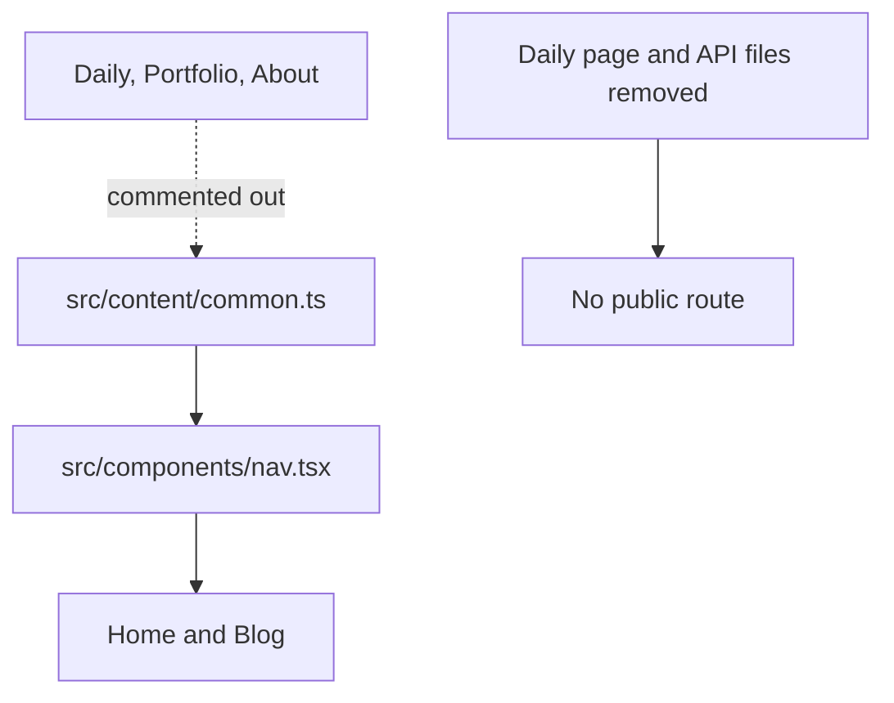

# Nav, Layout, and Content Structure



## Navigation State (v1)

Daily, Portfolio, and About tabs are **intentionally commented out**. Daily's
page and API route files are deleted, so Next.js does not expose `/daily`,
`/daily/[id]`, or `/api/daily`. Its shared components and reader remain, but the
Daily article files were removed on 2026-08-20.

```ts
// src/content/common.ts
export const NAV_LINKS = [
  { href: '/',     label: '主页' },
  { href: '/blog', label: '文章' },
  // { href: '/daily',     label: '笔记' },
  // { href: '/portfolio', label: '作品集' },  ← hidden for v1
  // { href: '/about',     label: '关于' },     ← hidden for v1
];
```

To re-enable Daily, recreate its page and API route files, uncomment its nav item,
and restore its search adapter. Portfolio and About only require their nav items
to be uncommented; their pages remain complete.

## Root Layout

`src/app/layout.tsx` renders `<Nav>` and `<Footer>` for all pages. Structure:

```tsx
<ThemeProvider>
  <Nav />                         {/* position: sticky, top: 0, z-index: 40 */}
  <main style={{ flex: 1 }}>      {/* fills remaining height */}
    {children}
  </main>
  <Footer />                      {/* scrolls with content */}
</ThemeProvider>
```

Body is `display: flex; flex-direction: column; min-height: 100dvh`. Nav is sticky; Footer scrolls (not fixed). Pages that need the full-bleed layout should use `.page` class.

### Font Loading Constraint

`src/app/layout.tsx` uses `next/font/local` for both serif content fonts and the mono UI variable. The mono slot (`--font-ibm-plex-mono`) is currently backed by local [`src/app/fonts/GeistMonoLatin-Regular.woff2`](../src/app/fonts/GeistMonoLatin-Regular.woff2) rather than `next/font/google`.

Treat this as a build reliability invariant: in restricted or offline environments, `next/font/google` can fail the production build while fetching Google Fonts at build time. If you change the root mono font again, keep it self-hosted or verify that every build environment has outbound access.

## Logo Rendering

Desktop navigation keeps the animated SVG asset (`/logo-animated.svg`) unchanged. Mobile navigation and footer use crisp inline SVG variants from `src/components/logo.tsx`; the static logo assets use mask-based SVGs that can look blurry at small mobile sizes.

## Content Data Files

Static content data lives in `src/content/`:

| File | Purpose |
|------|---------|
| `common.ts` | Nav links, profile info, footer text |
| `photos.ts` | All photo series — single source of truth |
| `portfolio.ts` | Derived from `photos.ts` — do not add items manually |
| `home.ts` | Hero section copy |
| `about.ts` | About page copy |
| `blog.ts` | Blog page metadata (heading, description) |

## Shared CSS

`src/styles/site.css` contains shared utility classes (`.container`, `.eyebrow`, `.dy-tag`, `.dy-card`, `.toc-fixed`, etc.). Import it in layout or pages as needed — it is already imported in `src/app/layout.tsx`.

`src/app/globals.css` overrides design system CSS variables with Next.js `localFont` variables, and sets global body/article styles.

*Last updated: 2026-08-20 | Reason: document the disabled Daily entry and routes*
