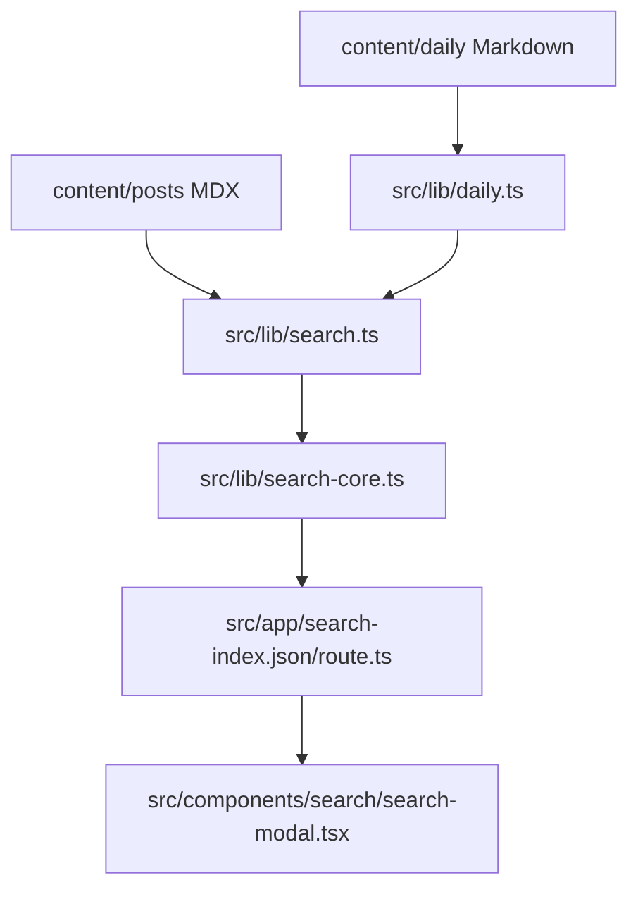

# Search System

Site search is a static, local-content index. Blog posts and daily entries are
read on the server, normalized into search documents, serialized by MiniSearch,
and served from `/search-index.json` as a static App Router route.

## Data Sources

`src/lib/search.ts` owns the source list. Add new local searchable paths there by
mapping each item into `SearchDocument` fields: `id`, `source`, `title`, `href`,
`date`, `tags`, optional `excerpt`, and `body`.

Current sources:

- `content/posts/*.mdx` through `src/lib/posts.ts`
- `content/daily/*.{md,mdx}` through `src/lib/daily.ts`

Daily entries may include Obsidian sync comments such as
`<!-- source: ... -->`; `src/lib/daily.ts` strips those before rendering or
indexing so local filesystem paths never appear on the site.

## Build Behavior

`src/app/search-index.json/route.ts` uses `dynamic = 'force-static'`, so the
index is generated at build time. Adding normal posts or daily entries does not
require search config changes because those readers already feed the index.

Adding a new section such as `notes` needs three deliberate updates:

1. Add a local reader for the content type.
2. Add its documents to `getSearchDocuments()` in `src/lib/search.ts`.
3. Add or extend tests in `test/search.test.mjs` to prove the source appears in
   the payload and snippets stay clean.

Keep `getSearchPayloadStats()` warnings aligned with Vercel bundle expectations
when the index grows.

---
*Last updated: 2026-06-06 | Reason: documented static local search index and future content-source onboarding*
