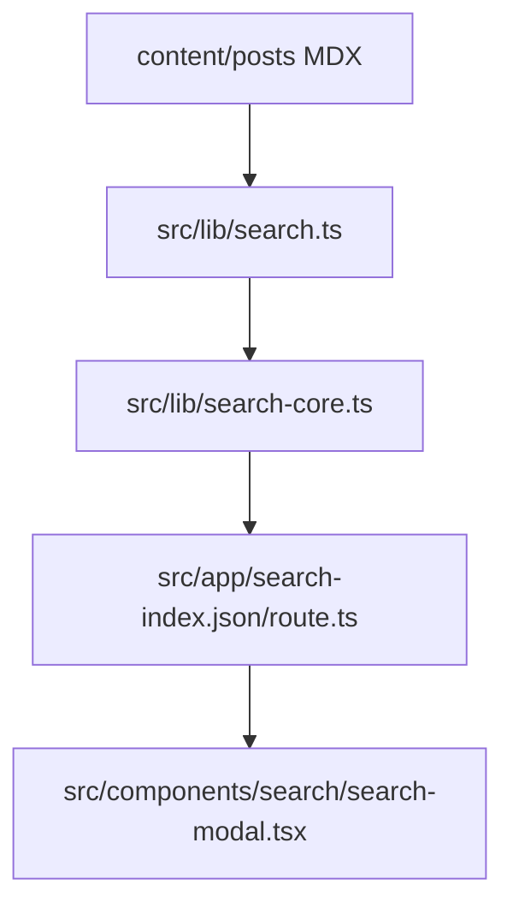

# Search System

```mermaid
flowchart TD
    Posts[content/posts MDX] --> SearchDocs[src/lib/search.ts]
    SearchDocs --> Payload[src/lib/search-core.ts]
    Payload --> Route[src/app/search-index.json/route.ts]
    Route --> Modal[src/components/search/search-modal.tsx]
```

Site search is a static, local-content index. Blog posts are read on the server,
normalized into search documents, serialized by MiniSearch, and served from
`/search-index.json` as a static App Router route. Daily entries are excluded
while the Daily routes are disabled so search never links to unavailable pages.

## Data Sources

`src/lib/search.ts` owns the source list. Add new local searchable paths there by
mapping each item into `SearchDocument` fields: `id`, `source`, `title`, `href`,
`date`, `tags`, optional `excerpt`, and `body`.

Current sources:

- `content/posts/*.mdx` through `src/lib/posts.ts`

Daily search documents must only be restored together with the Daily page routes.
Their private `source_path` frontmatter remains outside the public content model.

## Build Behavior

`src/app/search-index.json/route.ts` uses `dynamic = 'force-static'`, so the
index is generated at build time. Adding normal posts does not require search
config changes because the post reader already feeds the index.

Adding a new section such as `notes` needs three deliberate updates:

1. Add a local reader for the content type.
2. Add its documents to `getSearchDocuments()` in `src/lib/search.ts`.
3. Add or extend tests in `test/search.test.mjs` to prove the source appears in
   the payload and snippets stay clean.

Keep `getSearchPayloadStats()` warnings aligned with Vercel bundle expectations
when the index grows.

---
*Last updated: 2026-08-20 | Reason: exclude disabled Daily routes from site search*
